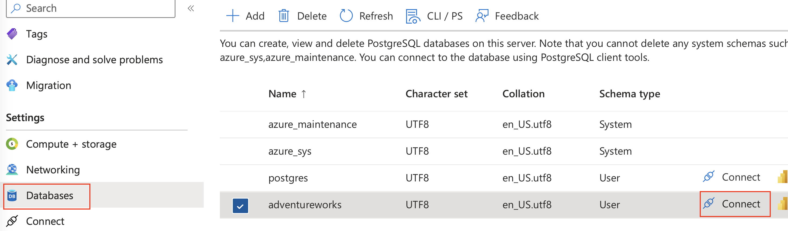
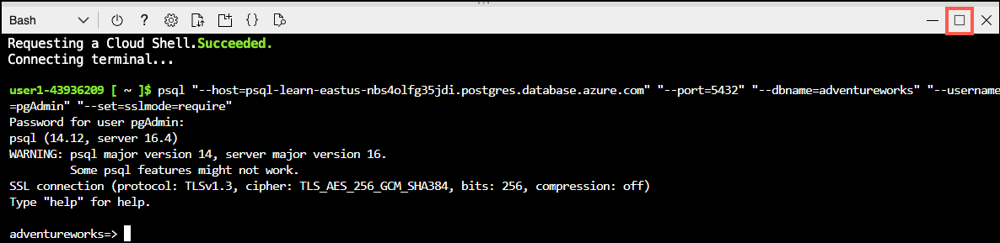

---
lab:
  title: 쿼리 저장소를 사용하여 쿼리 성능 평가
  module: Tune queries in Azure Database for PostgreSQL
---

# 쿼리 저장소를 사용하여 쿼리 성능 평가

이 연습에서는 Azure Database for PostgreSQL의 쿼리 저장소를 사용하여 성능 메트릭을 쿼리하는 방법을 알아봅니다.

## 시작하기 전에

이 모듈의 연습을 완료하려면 자체 Azure 구독이 필요합니다. Azure 구독이 없는 경우 [Azure 무료 계정으로 클라우드에서 빌드](https://azure.microsoft.com/free/)에서 무료 평가판 계정을 설정할 수 있습니다.

## 연습 환경 만들기

### Azure 구독에 리소스 배포

이 단계에서는 Azure Cloud Shell에서 Azure CLI 명령을 사용하여 리소스 그룹을 만들고 Bicep 스크립트를 실행하여 이 연습을 완료하는 데 필요한 Azure 서비스를 Azure 구독에 배포하는 방법을 안내합니다.

1. 웹 브라우저를 열고 [Azure Portal](https://portal.azure.com/)로 이동합니다.

2. Azure Portal 도구 모음의 **Cloud Shell** 아이콘을 선택하여 브라우저 창 아래쪽에 새 [Cloud Shell](https://learn.microsoft.com/azure/cloud-shell/overview) 창을 엽니다.

    

    메시지가 표시되는 경우 *Bash* 셸을 여는 데 필요한 옵션을 선택합니다. 이전에 *PowerShell* 콘솔을 사용한 적이 있다면 이것을 *Bash* 셸로 전환합니다.

3. Cloud Shell 프롬프트에서 다음을 입력하여 연습 리소스가 포함된 GitHub 리포지토리를 복제합니다.

    ```bash
    git clone https://github.com/MicrosoftLearning/mslearn-postgresql.git
    ```

4. 그 다음 Azure CLI 명령을 사용하여 Azure 리소스를 만들 때 중복 입력을 줄이기 위해 변수를 정의하는 세 가지 명령을 실행합니다. 이 변수는 리소스 그룹에 할당할 이름(`RG_NAME`), 리소스를 배포할 Azure 지역(`REGION`), PostgreSQL 관리자 로그인용 임의 생성 암호(`ADMIN_PASSWORD`)를 나타냅니다.

    첫 번째 명령에서는 해당 변수에 `eastus` 지역을 할당하지만, 원하는 위치로 바꿀 수도 있습니다.

    ```bash
    REGION=eastus
    ```

    다음 명령에서는 이 연습에서 사용할 모든 리소스를 저장하는 리소스 그룹에 사용할 이름을 할당합니다. 해당 변수에는 `rg-learn-work-with-postgresql-$REGION` 리소스 그룹 이름을 할당하며, 여기서 `$REGION` 부분은 앞에서 지정한 위치입니다. 그러나 원하는 다른 리소스 그룹 이름으로 변경할 수 있습니다.

    ```bash
    RG_NAME=rg-learn-work-with-postgresql-$REGION
    ```

    마지막 명령에서는 PostgreSQL 관리자 로그인에 사용할 암호를 임의로 생성합니다. 나중에 PostgreSQL 유연한 서버에 연결하는 데 사용하기 위해 이 암호를 안전한 장소에 복사해 두어야 합니다.

    ```bash
    a=()
    for i in {a..z} {A..Z} {0..9}; 
       do
       a[$RANDOM]=$i
    done
    ADMIN_PASSWORD=$(IFS=; echo "${a[*]::18}")
    echo "Your randomly generated PostgreSQL admin user's password is:"
    echo $ADMIN_PASSWORD
    ```

5. 두 개 이상의 Azure 구독에 액세스할 수 있고 기본 구독이 이 연습에 대한 리소스 그룹 및 기타 리소스를 만드는 데 사용할 구독이 아닌 경우, 이 명령을 실행할 때 적절한 구독을 설정하고 `<subscriptionName|subscriptionId>` 토큰을 사용할 구독의 이름 또는 ID로 바꿉니다.

    ```azurecli
    az account set --subscription <subscriptionName|subscriptionId>
    ```

6. 다음 Azure CLI 명령을 실행하여 리소스 그룹을 만듭니다.

    ```azurecli
    az group create --name $RG_NAME --location $REGION
    ```

7. 마지막으로 Azure CLI를 사용하여 Bicep 배포 스크립트를 실행하는 방법으로 리소스 그룹에 Azure 리소스를 프로비전합니다.

    ```azurecli
    az deployment group create --resource-group $RG_NAME --template-file "mslearn-postgresql/Allfiles/Labs/Shared/deploy-postgresql-server.bicep" --parameters adminLogin=pgAdmin adminLoginPassword=$ADMIN_PASSWORD databaseName=adventureworks
    ```

    Bicep 배포 스크립트는 이 연습을 완료하는 데 필요한 Azure 서비스를 리소스 그룹으로 프로비전합니다. 배포되는 리소스는 Azure Database for PostgreSQL- 유연한 서버입니다. 이 bicep 스크립트는 데이터베이스도 만듭니다. 이는 명령줄에서 매개 변수로 구성할 수 있습니다.

    배포를 완료하려면 보통 몇 분 정도 걸립니다. Cloud Shell에서 모니터링하거나 위에서 만든 리소스 그룹에 대한 **배포** 페이지로 이동하여 배포 진행 상황을 관찰할 수 있습니다.

8. 리소스 배포가 완료되면 Cloud Shell 창을 닫습니다.

### 배포 오류 문제 해결

Bicep 배포 스크립트를 실행할 때 몇 가지 오류가 발생할 수 있습니다. 가장 일반적인 메시지와 해결 단계는 다음과 같습니다.

- 이전에 이 학습 경로에 대한 Bicep 배포 스크립트를 실행한 후 리소스를 삭제한 경우, 리소스를 삭제하고 48시간 이내에 스크립트를 다시 실행하려고 하면 다음과 같은 오류 메시지가 표시될 수 있습니다.

    ```bash
    {"code": "InvalidTemplateDeployment", "message": "The template deployment 'deploy' is not valid according to the validation procedure. The tracking id is '4e87a33d-a0ac-4aec-88d8-177b04c1d752'. See inner errors for details."}
    
    Inner Errors:
    {"code": "FlagMustBeSetForRestore", "message": "An existing resource with ID '/subscriptions/{subscriptionId}/resourceGroups/rg-learn-postgresql-ai-eastus/providers/Microsoft.CognitiveServices/accounts/{accountName}' has been soft-deleted. To restore the resource, you must specify 'restore' to be 'true' in the property. If you don't want to restore existing resource, please purge it first."}
    ```

    이 메시지가 표시되면 위의 `azure deployment group create` 명령을 수정하여 `restore` 매개 변수를 `true`에 해당하도록 설정하고 다시 실행합니다.

- 선택한 지역이 특정 리소스를 프로비전하지 못하도록 제한된 경우 `REGION` 변수를 다른 위치로 설정하고 명령을 다시 실행하여 리소스 그룹을 만들고 Bicep 배포 스크립트를 실행해야 합니다.

    ```bash
    {"status":"Failed","error":{"code":"DeploymentFailed","target":"/subscriptions/{subscriptionId}/resourceGroups/{resourceGrouName}/providers/Microsoft.Resources/deployments/{deploymentName}","message":"At least one resource deployment operation failed. Please list deployment operations for details. Please see https://aka.ms/arm-deployment-operations for usage details.","details":[{"code":"ResourceDeploymentFailure","target":"/subscriptions/{subscriptionId}/resourceGroups/{resourceGroupName}/providers/Microsoft.DBforPostgreSQL/flexibleServers/{serverName}","message":"The resource write operation failed to complete successfully, because it reached terminal provisioning state 'Failed'.","details":[{"code":"RegionIsOfferRestricted","message":"Subscriptions are restricted from provisioning in this region. Please choose a different region. For exceptions to this rule please open a support request with Issue type of 'Service and subscription limits'. See https://review.learn.microsoft.com/en-us/azure/postgresql/flexible-server/how-to-request-quota-increase for more details."}]}]}}
    ```

- 책임 있는 AI 계약을 수락해야 하는 요구 사항으로 인해 스크립트가 AI 리소스를 만들 수 없는 경우 다음과 같은 오류가 발생할 수 있습니다. 이 경우 Azure Portal 사용자 인터페이스를 사용하여 Azure AI 서비스 리소스를 만든 다음 배포 스크립트를 다시 실행합니다.

    ```bash
    {"code": "InvalidTemplateDeployment", "message": "The template deployment 'deploy' is not valid according to the validation procedure. The tracking id is 'f8412edb-6386-4192-a22f-43557a51ea5f'. See inner errors for details."}
     
    Inner Errors:
    {"code": "ResourceKindRequireAcceptTerms", "message": "This subscription cannot create TextAnalytics until you agree to Responsible AI terms for this resource. You can agree to Responsible AI terms by creating a resource through the Azure Portal then trying again. For more detail go to https://go.microsoft.com/fwlink/?linkid=2164190"}
    ```

## Azure Cloud Shell에서 psql을 사용하여 데이터베이스에 연결

이 작업에서는 [Azure Cloud Shell](https://learn.microsoft.com/azure/cloud-shell/overview)의 [psql 명령줄 유틸리티](https://www.postgresql.org/docs/current/app-psql.html)를 사용하여 Azure Database for PostgreSQL 서버의 `adventureworks` 데이터베이스에 연결합니다.

1. [Azure Portal](https://portal.azure.com/)에서 새로 만든 Azure Database for PostgreSQL 유연한 서버로 이동합니다.

2. 리소스 메뉴의 **설정**에서 **데이터베이스**를 선택하고 `adventureworks` 데이터베이스에 대한 **연결**을 선택합니다.

    

3. Cloud Shell의 "사용자 pgAdmin에 대한 암호" 프롬프트에서 **pgAdmin** 로그인에 대해 임의로 생성된 암호를 입력합니다.

    로그인하면 `adventureworks` 데이터베이스에 대한 `psql` 프롬프트가 표시됩니다.

4. 이 연습의 이후 부분에서는 계속 Cloud Shell에서 작업하므로 창의 오른쪽 위에 있는 **최대화** 버튼을 선택하여 브라우저 창 내에서 해당 창을 확장하면 도움이 될 수 있습니다.

    

### 데이터를 이용해 데이터베이스 작성

1. 데이터베이스에 테이블을 만들고 샘플 데이터로 채워 이 연습에서 잠금을 검토할 때 사용할 정보를 준비합니다.
1. 다음 명령을 실행하여 데이터를 로드할 `production.workorder` 테이블을 만듭니다.

    ```sql
    /*********************************************************************************
    Create Schema: production
    *********************************************************************************/
    DROP SCHEMA IF EXISTS production CASCADE;
    CREATE SCHEMA production;
    
    /*********************************************************************************
    Create Table: production.workorder
    *********************************************************************************/
    
    DROP TABLE IF EXISTS production.workorder;
    CREATE TABLE production.workorder
    (
        workorderid integer NOT NULL,
        productid integer NOT NULL,
        orderqty integer NOT NULL,
        scrappedqty smallint NOT NULL,
        startdate timestamp without time zone NOT NULL,
        enddate timestamp without time zone,
        duedate timestamp without time zone NOT NULL,
        scrapreasonid smallint,
        modifieddate timestamp without time zone NOT NULL DEFAULT now()
    )
    WITH (
        OIDS = FALSE
    )
    TABLESPACE pg_default;
    ```

1. 다음으로, `COPY` 명령을 사용하여 위에서 만든 테이블에 CSV 파일의 데이터를 로드합니다. 먼저 다음 명령을 사용하여 `production.workorder` 테이블을 채웁니다.

    ```sql
    \COPY production.workorder FROM 'mslearn-postgresql/Allfiles/Labs/08/Lab8_workorder.csv' CSV HEADER
    ```

    명령의 출력은 `COPY 72591`이어야 합니다. 이는 CSV 파일의 테이블에 72591개의 행이 기록되었음을 나타냅니다.

1. 데이터가 로드되면 Cloud Shell 창을 닫습니다.

### Azure Data Studio로 데이터베이스에 연결

1. Azure Data Studio를 아직 설치하지 않은 경우 [***Azure Data Studio***를 다운로드하여 설치](https://go.microsoft.com/fwlink/?linkid=2282284)합니다.
1. Azure Data Studio를 시작합니다.
1. Azure Data Studio에서 **PostgreSQL** 확장을 설치하지 않은 경우 지금 설치합니다.
1. **연결**을 선택합니다.
1. **서버**를 선택하고 **새 연결**을 선택합니다.
1. **연결 형식**에서 **PostgreSQL**을 선택합니다.
1. **서버 이름**에 서버를 배포할 때 지정한 값을 입력합니다.
1. **사용자 이름**에 **pgAdmin**을 입력합니다.
1. **암호**에서 앞서 생성한 **pgAdmin** 로그인에 대해 임의로 생성된 암호를 입력합니다.
1. **암호 저장**을 선택합니다.
1. **연결**을 클릭합니다.

### 데이터베이스 내에 테이블 만들기

1. **데이터베이스**를 확장하고 **adventureworks**를 마우스 오른쪽 단추로 클릭한 다음, **새 쿼리**를 선택합니다.
   
    

1. **SQLQuery_1** 탭을 선택하고, 다음 쿼리를 입력하고, **실행**을 선택합니다.

    ```sql
    SELECT * FROM production.workorder;
    ```

## 작업 1: 쿼리 캡처 모드 켜기

1. Azure Portal로 이동하고 로그인합니다.
1. 이 연습에서 Azure Database for PostgreSQL 서버를 선택합니다.
1. **설정**에서 **서버 매개 변수**를 선택합니다.
1. **`pg_qs.query_capture_mode`** 설정으로 이동합니다.
1. **상위**를 선택합니다.

   

1. **`pgms_wait_sampling.query_capture_mode`** 이동 후 **전체**를 선택하고 **저장**을 선택합니다.
   
    
   
1. 서버 매개 변수가 업데이트될 때까지 기다립니다.

## pg_stat 데이터 보기

1. Azure Data Studio를 시작합니다.
1. **연결**을 선택합니다.
   
    
   
1. PostgreSQL 서버를 선택하고 **연결**을 선택합니다.
1. 다음 쿼리를 입력하고 **실행**을 선택합니다.

    ```sql
    SELECT 
        pid,                    -- Process ID of the server process
        datid,                  -- OID of the database
        datname,                -- Name of the database
        usename,                -- Name of the user
        application_name,       -- Name of the application connected to the database
        client_addr,            -- IP address of the client
        client_hostname,        -- Hostname of the client (if available)
        client_port,            -- TCP port number that the client is using for the connection
        backend_start,          -- Timestamp when the backend process started
        xact_start,             -- Timestamp of the current transaction start, if any
        query_start,            -- Timestamp when the current query started, if any
        state_change,           -- Timestamp when the state was last changed
        wait_event_type,        -- Type of event the backend is waiting for, if any
        wait_event,             -- Event that the backend is waiting for, if any
        state,                  -- Current state of the session (e.g., active, idle, etc.)
        backend_xid,            -- Transaction ID, if active
        backend_xmin,           -- Transaction ID that the process is working with
        query,                  -- Text of the query being executed
        encode(backend_type::bytea, 'escape') AS backend_type,           -- Type of backend (e.g., client backend, autovacuum worker). We use encode(…, 'escape') to safely display raw data with invalid characters by converting it into a readable format, doing this prevents a UTF-8 conversion error in Azure Data Studio.
        leader_pid,             -- PID of the leader process, if this is a parallel worker
        query_id               -- Query ID (added in more recent PostgreSQL versions)
    FROM pg_stat_activity;
    ```

1. 사용 가능한 메트릭을 검토합니다.
1. 다음 작업을 위해 Azure Data Studio를 열어 둡니다.

## 작업 2: 쿼리 통계 검사

> [!NOTE]
> 새로 만든 데이터베이스의 경우 통계가 제한될 수 있습니다(있는 경우). 30분 동안 기다리면 백그라운드 프로세스의 통계가 표시됩니다.

1. **azure_sys** 데이터베이스를 선택합니다.

    

1. 다음 쿼리를 각각 입력하고 **실행**을 선택합니다.

    ```sql
    SELECT * FROM query_store.query_texts_view;
    ```

    ```sql
    SELECT * FROM query_store.qs_view;
    ```

    ```sql
    SELECT * FROM query_store.runtime_stats_view;
    ```

    ```sql
    SELECT * FROM query_store.pgms_wait_sampling_view;
    ```

1. 사용 가능한 메트릭을 검토합니다.

## 연습 정리

이 연습에서 배포한 Azure Database for PostgreSQL에는 요금이 발생하며, 이 연습 후에 서버를 삭제할 수 있습니다. 또는 **rg-learn-work-with-postgresql-eastus** 리소스 그룹을 삭제하여 이 연습의 일부로 배포한 모든 리소스를 제거할 수 있습니다.
