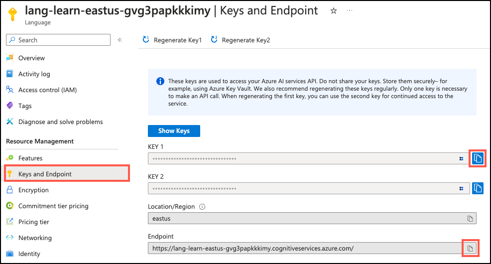

---
lab:
  title: Azure AI 확장 살펴보기
  module: Explore Generative AI with Azure Database for PostgreSQL
---

# Azure AI 확장 살펴보기

Margie's Travel의 수석 개발자는 고객에게 임대 부동산에 대한 인텔리전트 권장 사항을 제공하는 AI 기반 애플리케이션을 빌드하는 임무를 맡았습니다. Azure Database for PostgreSQL의 `azure_ai` 확장에 대해 자세히 알아보고, 이를 통해 앱에 GenAI(생성형 AI)의 성능을 통합하는 데 어떻게 도움이 되는지 알아봅니다. 이 연습에서는 `azure_ai` 확장 및 기능을 살펴보는 데 있어 Azure Database for PostgreSQL 유연한 서버 데이터베이스에 설치하고 Azure AI 및 ML 서비스 통합을 위한 그 기능을 검토합니다.

## 시작하기 전에

관리 권한이 있는 [Azure 구독](https://azure.microsoft.com/free)이 필요하며 해당 구독에서 Azure OpenAI 액세스에 대한 승인을 받아야 합니다. Azure OpenAI 액세스가 필요한 경우 [Azure OpenAI 제한된 액세스](https://learn.microsoft.com/legal/cognitive-services/openai/limited-access) 페이지에서 신청하세요.

### Azure 구독에 리소스 배포

이 단계에서는 Azure Cloud Shell에서 Azure CLI 명령을 사용하여 리소스 그룹을 만들고 Bicep 스크립트를 실행하여 이 연습을 완료하는 데 필요한 Azure 서비스를 Azure 구독에 배포하는 방법을 안내합니다.

1. 웹 브라우저를 열고 [Azure Portal](https://portal.azure.com/)로 이동합니다.

2. Azure Portal 도구 모음의 **Cloud Shell** 아이콘을 선택하여 브라우저 창 아래쪽에 새 [Cloud Shell](https://learn.microsoft.com/azure/cloud-shell/overview) 창을 엽니다.

    

    메시지가 표시되는 경우 *Bash* 셸을 여는 데 필요한 옵션을 선택합니다. 이전에 *PowerShell* 콘솔을 사용한 적이 있다면 이것을 *Bash* 셸로 전환합니다.

3. Cloud Shell 프롬프트에서 다음을 입력하여 연습 리소스가 포함된 GitHub 리포지토리를 복제합니다.

    ```bash
    git clone https://github.com/MicrosoftLearning/mslearn-postgresql.git
    ```

4. 그 다음 Azure CLI 명령을 사용하여 Azure 리소스를 만들 때 중복 입력을 줄이기 위해 변수를 정의하는 세 가지 명령을 실행합니다. 이 변수는 리소스 그룹에 할당할 이름(`RG_NAME`), 리소스를 배포할 Azure 지역(`REGION`), PostgreSQL 관리자 로그인용 임의 생성 암호(`ADMIN_PASSWORD`)를 나타냅니다.

    첫 번째 명령에서는 해당 변수에 `eastus` 지역을 할당하지만, 원하는 위치로 바꿀 수도 있습니다. 그러나 기본값을 바꾸는 경우 다른 [추상 요약을 지원하는 Azure 지역](https://learn.microsoft.com/azure/ai-services/language-service/summarization/region-support)을 선택해야 이 학습 경로의 모듈에 있는 모든 작업을 완료할 수 있습니다.

    ```bash
    REGION=eastus
    ```

    다음 명령에서는 이 연습에서 사용할 모든 리소스를 저장하는 리소스 그룹에 사용할 이름을 할당합니다. 해당 변수에는 `rg-learn-postgresql-ai-$REGION` 리소스 그룹 이름을 할당하며, 여기서 `$REGION` 부분은 앞에서 지정한 위치입니다. 그러나 원하는 다른 리소스 그룹 이름으로 변경할 수 있습니다.

    ```bash
    RG_NAME=rg-learn-postgresql-ai-$REGION
    ```

    마지막 명령에서는 PostgreSQL 관리자 로그인에 사용할 암호를 임의로 생성합니다. 나중에 PostgreSQL 유연한 서버에 연결할 때 사용할 수 있도록 안전한 장소에 복사합니다.

    ```bash
    a=()
    for i in {a..z} {A..Z} {0..9}; 
        do
        a[$RANDOM]=$i
    done
    ADMIN_PASSWORD=$(IFS=; echo "${a[*]::18}")
    echo "Your randomly generated PostgreSQL admin user's password is:"
    echo $ADMIN_PASSWORD
    ```

5. 두 개 이상의 Azure 구독에 액세스할 수 있고 기본 구독이 이 연습에 대한 리소스 그룹 및 기타 리소스를 만드는 데 사용할 구독이 아닌 경우, 이 명령을 실행할 때 적절한 구독을 설정하고 `<subscriptionName|subscriptionId>` 토큰을 사용할 구독의 이름 또는 ID로 바꿉니다.

    ```azurecli
    az account set --subscription <subscriptionName|subscriptionId>
    ```

6. 다음 Azure CLI 명령을 실행하여 리소스 그룹을 만듭니다.

    ```azurecli
    az group create --name $RG_NAME --location $REGION
    ```

7. 마지막으로 Azure CLI를 사용하여 Bicep 배포 스크립트를 실행하는 방법으로 리소스 그룹에 Azure 리소스를 프로비전합니다.

    ```azurecli
    az deployment group create --resource-group $RG_NAME --template-file "mslearn-postgresql/Allfiles/Labs/Shared/deploy.bicep" --parameters restore=false adminLogin=pgAdmin adminLoginPassword=$ADMIN_PASSWORD
    ```

    Bicep 배포 스크립트는 이 연습을 완료하는 데 필요한 Azure 서비스를 리소스 그룹으로 프로비전합니다. 배포 리소스에는 Azure Database for PostgreSQL 유연한 서버, Azure OpenAI, Azure AI 언어 서비스가 포함됩니다. 또한 Bicep 스크립트는 azure.extensions 서버 매개 변수를 통해 PostgreSQL 서버의 _허용 목록_에 `azure_ai` 및 `vector` 확장을 추가하고, 서버에 `rentals` 데이터베이스를 만들고, Azure OpenAI Service에 `text-embedding-ada-002` 모델을 사용한 `embedding` 배포를 추가하는 등 몇 가지 구성 단계를 수행합니다. 이 Bicep 파일은 이 학습 경로의 모든 모듈에서 공유되므로 일부 연습에서는 배포된 리소스 중 일부만 사용할 수 있다는 점에 유의해야 합니다.

    배포를 완료하려면 보통 몇 분 정도 걸립니다. Cloud Shell에서 모니터링하거나 위에서 만든 리소스 그룹에 대한 **배포** 페이지로 이동하여 배포 진행 상황을 관찰할 수 있습니다.

 8. 리소스 배포가 완료되면 Cloud Shell 창을 닫습니다.
 
### 배포 오류 문제 해결

Bicep 배포 스크립트를 실행할 때 몇 가지 오류가 발생할 수 있습니다.

- 이전에 이 학습 경로에 대한 Bicep 배포 스크립트를 실행한 후 리소스를 삭제한 경우, 리소스를 삭제하고 48시간 이내에 스크립트를 다시 실행하려고 하면 다음과 같은 오류 메시지가 표시될 수 있습니다.

    ```bash
    {"code": "InvalidTemplateDeployment", "message": "The template deployment 'deploy' is not valid according to the validation procedure. The tracking id is '4e87a33d-a0ac-4aec-88d8-177b04c1d752'. See inner errors for details."}
    
    Inner Errors:
    {"code": "FlagMustBeSetForRestore", "message": "An existing resource with ID '/subscriptions/{subscriptionId}/resourceGroups/rg-learn-postgresql-ai-eastus/providers/Microsoft.CognitiveServices/accounts/{accountName}' has been soft-deleted. To restore the resource, you must specify 'restore' to be 'true' in the property. If you don't want to restore existing resource, please purge it first."}
    ```

    이 메시지가 표시되면 위의 `azure deployment group create` 명령을 수정하여 `restore` 매개 변수를 `true`에 해당하도록 설정하고 다시 실행합니다.

- 선택한 지역이 특정 리소스를 프로비전하지 못하도록 제한된 경우 `REGION` 변수를 다른 위치로 설정하고 명령을 다시 실행하여 리소스 그룹을 만들고 Bicep 배포 스크립트를 실행해야 합니다.

    ```bash
    {"status":"Failed","error":{"code":"DeploymentFailed","target":"/subscriptions/{subscriptionId}/resourceGroups/{resourceGrouName}/providers/Microsoft.Resources/deployments/{deploymentName}","message":"At least one resource deployment operation failed. Please list deployment operations for details. Please see https://aka.ms/arm-deployment-operations for usage details.","details":[{"code":"ResourceDeploymentFailure","target":"/subscriptions/{subscriptionId}/resourceGroups/{resourceGrouName}/providers/Microsoft.DBforPostgreSQL/flexibleServers/{serverName}","message":"The resource write operation failed to complete successfully, because it reached terminal provisioning state 'Failed'.","details":[{"code":"RegionIsOfferRestricted","message":"Subscriptions are restricted from provisioning in this region. Please choose a different region. For exceptions to this rule please open a support request with Issue type of 'Service and subscription limits'. See https://review.learn.microsoft.com/en-us/azure/postgresql/flexible-server/how-to-request-quota-increase for more details."}]}]}}
    ```

- 책임 있는 AI 계약을 수락해야 하는 요구 사항으로 인해 스크립트가 AI 리소스를 만들 수 없는 경우 다음과 같은 오류가 발생할 수 있습니다. 이 경우 Azure Portal 사용자 인터페이스를 사용하여 Azure AI 서비스 리소스를 만든 다음 배포 스크립트를 다시 실행합니다.

    ```bash
    {"code": "InvalidTemplateDeployment", "message": "The template deployment 'deploy' is not valid according to the validation procedure. The tracking id is 'f8412edb-6386-4192-a22f-43557a51ea5f'. See inner errors for details."}
     
    Inner Errors:
    {"code": "ResourceKindRequireAcceptTerms", "message": "This subscription cannot create TextAnalytics until you agree to Responsible AI terms for this resource. You can agree to Responsible AI terms by creating a resource through the Azure Portal then trying again. For more detail go to https://go.microsoft.com/fwlink/?linkid=2164190"}
    ```

## Azure Cloud Shell에서 psql을 사용하여 데이터베이스에 연결

이 작업에서는 [Azure Cloud Shell](https://learn.microsoft.com/azure/cloud-shell/overview)의 [psql 명령줄 유틸리티](https://www.postgresql.org/docs/current/app-psql.html)를 사용하여 Azure Database for PostgreSQL 유연한 서버의 `rentals` 데이터베이스에 연결합니다.

1. [Azure Portal](https://portal.azure.com/)에서 새로 만든 Azure Database for PostgreSQL 유연한 서버로 이동합니다.

2. 리소스 메뉴의 **설정**에서 **데이터베이스**를 선택하고 `rentals` 데이터베이스에 대한 **연결**을 선택합니다.

    

3. Cloud Shell의 "사용자 pgAdmin에 대한 암호" 프롬프트에서 **pgAdmin** 로그인에 대해 임의로 생성된 암호를 입력합니다.

    로그인하면 `rentals` 데이터베이스에 대한 `psql` 프롬프트가 표시됩니다.

4. 이 연습의 이후 부분에서는 계속 Cloud Shell에서 작업하므로 창의 오른쪽 위에 있는 **최대화** 버튼을 선택하여 브라우저 창 내에서 해당 창을 확장하면 도움이 될 수 있습니다.

    

## 샘플 데이터를 이용해 데이터베이스 작성

`azure_ai` 확장을 탐색하기 전에 `rentals` 데이터베이스에 테이블을 몇 개 추가하고 샘플 데이터로 채워 확장의 기능을 검토할 때 사용할 정보를 준비합니다.

1. 다음 명령을 실행하여 임대 부동산 목록 및 고객 리뷰 데이터를 저장하기 위한 `listings` 및 `reviews` 테이블을 만듭니다.

    ```sql
    DROP TABLE IF EXISTS listings;
    
    CREATE TABLE listings (
      id int,
      name varchar(100),
      description text,
      property_type varchar(25),
      room_type varchar(30),
      price numeric,
      weekly_price numeric
    );
    ```

    ```sql
    DROP TABLE IF EXISTS reviews;
    
    CREATE TABLE reviews (
      id int,
      listing_id int, 
      date date,
      comments text
    );
    ```

2. 다음으로, `COPY` 명령을 사용하여 위에서 만든 각 테이블에 CSV 파일의 데이터를 로드합니다. 먼저 다음 명령을 사용하여 `listings` 테이블을 채웁니다.

    ```sql
    \COPY listings FROM 'mslearn-postgresql/Allfiles/Labs/Shared/listings.csv' CSV HEADER
    ```

    명령의 출력은 `COPY 50`이어야 합니다. 이는 CSV 파일의 테이블에 50개의 행이 기록되었음을 나타냅니다.

3. 마지막으로 아래 명령을 실행하여 고객 리뷰를 `reviews` 테이블에 로드합니다.

    ```sql
    \COPY reviews FROM 'mslearn-postgresql/Allfiles/Labs/Shared/reviews.csv' CSV HEADER
    ```

    명령의 출력은 `COPY 354`여야 합니다. 이는 CSV 파일의 테이블에 354개의 행이 기록되었음을 나타냅니다.

## `azure_ai` 확장 설치 및 구성

`azure_ai` 확장을 사용하기 전에는 확장을 데이터베이스에 설치하고 Azure AI Services 리소스에 연결하도록 구성해야 합니다. `azure_ai` 확장을 사용하면 Azure OpenAI 및 Azure AI 언어 서비스를 데이터베이스에 통합할 수 있습니다. 데이터베이스에서 확장을 사용하도록 설정하려면 다음 단계를 수행합니다.

1. `psql` 프롬프트에서 다음 명령을 실행하여, 환경을 설정할 때 실행한 Bicep 배포 스크립트를 통해 `azure_ai` 및 `vector`확장이 서버의 _허용 목록_에 성공적으로 추가되었는지 확인합니다.

    ```sql
    SHOW azure.extensions;
    ```

    이 명령은 서버의 _허용 목록_에 확장 목록을 표시합니다. 모든 항목이 올바르게 설치된 경우 다음과 같이 출력에 `azure_ai` 및 `vector`가 포함되어 있어야 합니다.

    ```sql
     azure.extensions 
    ------------------
     azure_ai,vector
    ```

    Azure Database for PostgreSQL 유연한 서버 데이터베이스에서 확장을 설치 및 사용하려면 [PostgreSQL 확장 사용 방법](https://learn.microsoft.com/azure/postgresql/flexible-server/concepts-extensions#how-to-use-postgresql-extensions)에 설명된 대로 서버의 _허용 목록_에 추가해야 합니다.

2. 이제 [CREATE EXTENSION](https://www.postgresql.org/docs/current/sql-createextension.html) 명령을 사용하여 `azure_ai` 확장을 설치할 수 있습니다.

    ```sql
    CREATE EXTENSION IF NOT EXISTS azure_ai;
    ```

    `CREATE EXTENSION` 명령은 스크립트 파일을 실행하여 데이터베이스에 새 확장을 로드합니다. 이 스크립트는 일반적으로 함수, 데이터 형식, 스키마와 같은 새 SQL 개체를 만듭니다. 동일한 이름의 확장이 이미 있는 경우 오류가 표시됩니다. `IF NOT EXISTS` 문을 추가하면 확장이 이미 설치된 경우 오류를 표시하지 않고 명령을 실행할 수 있습니다.

## `azure_ai` 확장 내에 포함된 개체 검사

`azure_ai` 확장에 포함된 개체를 검토하면 해당 기능을 더 잘 이해할 수 있습니다. 이 작업에서는 확장에 의해 데이터베이스에 추가된 다양한 스키마, UDF(사용자 정의 함수) 및 복합 형식을 검사합니다.

1. Cloud Shell에서 `psql` 작업 시 쿼리 결과에 확장된 디스플레이를 사용하도록 설정하면 후속 명령에 대한 출력의 가독성이 향상되어 유용할 수 있습니다. 확장된 디스플레이를 자동으로 적용할 수 있도록 허용하려면 다음 명령을 실행합니다.

    ```sql
    \x auto
    ```

2. [`\dx` 메타 명령은](https://www.postgresql.org/docs/current/app-psql.html#APP-PSQL-META-COMMAND-DX-LC) 확장에 포함된 개체를 나열하는 데 사용됩니다. `psql` 명령 프롬프트에서 다음을 실행하여 `azure_ai` 확장에 있는 개체를 확인합니다. 개체의 전체 목록을 보려면 스페이스바를 눌러야 할 수 있습니다.

    ```psql
    \dx+ azure_ai
    ```

    메타 명령 출력은 `azure_ai` 확장이 네 개의 스키마, 여러 UDF(사용자 정의 함수), 데이터베이스의 여러 복합 유형 및 `azure_ai.settings` 테이블을 만든다는 것을 보여줍니다. 스키마를 제외한 모든 개체 이름 앞에는 해당 개체가 속한 스키마가 붙습니다. 스키마는 확장이 버킷에 추가하는 관련 함수 및 유형을 그룹화하는 데 사용됩니다. 아래 테이블에서는 확장에서 추가된 스키마를 나열하고 각각에 대해 설명합니다.

    | 스키마      | 설명                                              |
    | ----------------- | ------------------------------------------------------------------------------------------------------ |
    | `azure_ai`    | 구성 테이블 및 확장과 상호 작용하기 위한 UDF가 있는 주 스키마입니다. |
    | `azure_openai`  | Azure OpenAI 엔드포인트를 호출할 수 있는 UDF가 포함됩니다.                    |
    | `azure_cognitive` | 데이터베이스를 Azure AI Services와 통합하는 데 관련된 UDF 및 복합 형식을 제공합니다.     |
    | `azure_ml`    | Azure ML(Machine Learning) 서비스를 통합하기 위한 UDF를 포함합니다.                |

### Azure AI 스키마 살펴보기

`azure_ai` 스키마는 데이터베이스에서 Azure AI 및 ML 서비스와 직접 상호 작용하기 위한 프레임워크를 제공합니다. 이러한 서비스에 대한 연결을 설정하고 동일한 스키마에서 호스팅되는 `settings` 테이블에서 이를 검색하기 위한 함수가 포함되어 있습니다. 이 `settings` 테이블은 Azure AI 및 ML 서비스와 연결된 엔드포인트 및 키에 대한 보안 스토리지를 데이터베이스에 제공합니다.

1. 스키마에 정의된 함수를 검토하려면 [`\df` 메타 명령](https://www.postgresql.org/docs/current/app-psql.html#APP-PSQL-META-COMMAND-DF-LC)을 사용하여 함수를 표시해야 하는 스키마를 지정합니다. 다음을 실행하여 `azure_ai` 스키마에서 함수를 확인합니다.

    ```sql
    \df azure_ai.*
    ```

    명령의 출력은 이와 유사한 테이블이어야 합니다.

    ```sql
                  List of functions
     Schema |  Name  | Result data type | Argument data types | Type 
    ----------+-------------+------------------+----------------------+------
     azure_ai | get_setting | text      | key text      | func
     azure_ai | set_setting | void      | key text, value text | func
     azure_ai | version  | text      |           | func
    ```

    `set_setting()` 함수를 사용하면 확장이 연결할 수 있도록 Azure AI 및 ML 서비스의 엔드포인트와 키를 설정할 수 있습니다. 이는 **키**와 이에 할당할 **값**을 입력으로 받습니다. `azure_ai.get_setting()` 함수는 `set_setting()` 함수로 설정한 값을 검색하는 방법을 제공합니다. 이는 확인하려는 설정의 **키**를 입력으로 받아 해당 키에 할당된 값을 반환합니다. 두 방법 모두에서 키는 다음 중 하나여야 합니다.

    | 키 | 설명 |
    | --- | ----------- |
    | `azure_openai.endpoint` | 지원되는 OpenAI 엔드포인트(예: <https://example.openai.azure.com>) |
    | `azure_openai.subscription_key` | Azure OpenAI 리소스에 대한 구독 키 |
    | `azure_cognitive.endpoint` | 지원되는 Azure AI 서비스 엔드포인트(예: <https://example.cognitiveservices.azure.com>). |
    | `azure_cognitive.subscription_key` | Azure AI 서비스 리소스에 대한 구독 키. |
    | `azure_ml.scoring_endpoint` | 지원되는 Azure ML 점수 매기기 엔드포인트(예: <https://example.eastus2.inference.ml.azure.com/score>) |
    | `azure_ml.endpoint_key` | Azure ML 배포를 위한 엔드포인트 키. |

    > Important
    >
    > API 키를 포함한 Azure AI 서비스에 대한 연결 정보는 데이터베이스의 구성 테이블에 저장되므로 이 정보가 보호되고 해당 역할이 할당된 사용자만 액세스할 수 있도록 `azure_ai` 확장은 `azure_ai_settings_manager` 역할을 정의합니다. 이 역할을 통해 확장과 관련된 설정을 읽고 쓸 수 있습니다. `azure_ai_settings_manager` 역할의 구성원만 `azure_ai.get_setting()` 및 `azure_ai.set_setting()` 함수를 호출할 수 있습니다. Azure Database for PostgreSQL 유연한 서버에서 모든 관리자 사용자(`azure_pg_admin` 역할이 할당된 사용자)에게도 `azure_ai_settings_manager` 역할이 할당됩니다.

2. `azure_ai.set_setting()` 및 `azure_ai.get_setting()` 함수를 사용하는 방법을 시연하려면 Azure OpenAI 계정에 대한 연결을 구성합니다. Cloud Shell이 열려 있는 동일한 브라우저 탭을 사용하여 Cloud Shell 창을 최소화하거나 복원하고, [Azure Portal](https://portal.azure.com/)에서 Azure OpenAI 리소스로 이동합니다. Azure OpenAI 리소스 페이지에서 리소스 메뉴의 **리소스 관리** 섹션에서 **키 및 엔드포인트**를 선택한 다음 엔드포인트와 사용 가능한 키 중 하나를 복사합니다.

    

    `KEY 1` 또는 `KEY 2`를 사용할 수 있습니다. 항상 두 개의 키를 사용하면 서비스 중단 없이 키를 안전하게 회전하고 다시 생성할 수 있습니다.

3. 엔드포인트와 키가 있으면 Cloud Shell 창을 다시 최대화한 다음 아래 명령을 사용하여 구성 테이블에 값을 추가합니다. `{endpoint}` 및 `{api-key}` 토큰을 Azure Portal에서 복사한 값으로 바꿔야 합니다.

    ```sql
    SELECT azure_ai.set_setting('azure_openai.endpoint', '{endpoint}');
    ```

    ```sql
    SELECT azure_ai.set_setting('azure_openai.subscription_key', '{api-key}');
    ```

4. 다음 쿼리에서 `azure_ai.get_setting()` 함수를 사용하여 `azure_ai.settings` 테이블에 기록된 설정을 확인할 수 있습니다.

    ```sql
    SELECT azure_ai.get_setting('azure_openai.endpoint');
    SELECT azure_ai.get_setting('azure_openai.subscription_key');
    ```

    이제 `azure_ai` 확장이 Azure OpenAI 계정에 연결되었습니다.

### Azure OpenAI 스키마 검토

`azure_openai` 스키마는 Azure OpenAI를 사용하여 텍스트 값의 벡터 임베딩 생성을 데이터베이스에 통합하는 기능을 제공합니다. 이 스키마를 사용하면 데이터베이스에서 직접 [Azure OpenAI를 통해 임베딩을 생성](https://learn.microsoft.com/azure/ai-services/openai/how-to/embeddings)하여 입력 텍스트의 벡터 표현을 만들 수 있습니다. 그런 다음, 벡터 유사성 검색에 사용하고 기계 학습 모델에서 사용할 수 있습니다. 스키마에는 두 오버로드가 있는 단일 함수 `create_embeddings()`가 포함됩니다. 한 오버로드는 단일 입력 문자열을 허용하고 다른 오버로드는 입력 문자열 배열을 필요로 합니다.

1. 위에서 한 것처럼 [`\df` 메타 명령](https://www.postgresql.org/docs/current/app-psql.html#APP-PSQL-META-COMMAND-DF-LC)을 사용하여 `azure_openai` 스키마에 있는 함수의 세부 정보를 볼 수 있습니다:

    ```sql
    \df azure_openai.*
    ```

    출력에는 `azure_openai.create_embeddings()` 함수의 두 가지 오버로드가 표시되어 두 버전의 함수와 반환하는 유형 간의 차이점을 검토할 수 있습니다. 출력의 `Argument data types` 속성은 두 함수 오버로드에 필요한 인수 목록을 표시합니다.

    | 인수    | Type       | 기본값 | 설명                                                          |
    | --------------- | ------------------ | ------- | ------------------------------------------------------------------------------------------------------------------------------ |
    | deployment_name | `text`      |    | `text-embedding-ada-002` 모델               이 포함된 Azure OpenAI Studio의 배포 이름입니다.|
    | input     | `text` 또는 `text[]` |    | 임베딩이 생성될 텍스트(또는 텍스트 배열)를 입력합니다.                                |
    | batch_size   | `integer`     | 100  | `text[]` 입력이 필요한 오버로드에만 해당됩니다. 한 번에 처리할 레코드 수를 지정합니다.          |
    | timeout_ms   | `integer`     | 3600000 | 작업이 중지된 후의 시간 제한(밀리초)입니다.                                 |
    | throw_on_error | `boolean`     | true  | 함수가 오류 발생 시 예외를 throw하여 래핑 트랜잭션을 롤백해야 하는지 여부를 나타내는 플래그입니다. |
    | max_attempts  | `integer`     | 1   | 오류가 발생한 경우 Azure OpenAI 서비스 호출을 다시 시도하는 횟수입니다.                     |
    | retry_delay_ms | `integer`     | 1000  | Azure OpenAI 서비스 엔드포인트 호출을 다시 시도하기 전에 대기하는 시간(밀리초)입니다.        |

2. 함수 사용의 기본 예를 제공하려면 다음 쿼리를 실행하여 `listings` 테이블의 `description` 필드에 대한 벡터 임베딩을 생성합니다. 함수의 `deployment_name` 매개 변수는 `embedding`으로 설정되며, 이는 Azure OpenAI 서비스에서 `text-embedding-ada-002` 모델의 배포 이름입니다(해당 이름은 Bicep 배포 스크립트를 통해 생성되었습니다).

    ```sql
    SELECT
      id,
      name,
      azure_openai.create_embeddings('embedding', description) AS vector
    FROM listings
    LIMIT 1;
    ```

    출력은 다음과 비슷합니다.

    ```sql
     id |      name       |              vector
    ----+-------------------------------+------------------------------------------------------------
      1 | Stylish One-Bedroom Apartment | {0.020068742,0.00022734122,0.0018286322,-0.0064167166,...}
    ```

    간결성을 위해 벡터 임베딩은 위의 출력에서 축약되었습니다.

    [임베딩](https://learn.microsoft.com/azure/postgresql/flexible-server/generative-ai-overview#embeddings)은 다차원 공간에서 단어, 문서 또는 엔터티와 같은 개체를 [벡터](https://learn.microsoft.com/azure/postgresql/flexible-server/generative-ai-overview#vectors)로 표현하는 기계 학습 및 NLP(자연어 처리)의 개념입니다. 임베딩을 통해 머신러닝 모델은 두 정보가 얼마나 밀접하게 연관되어 있는지 평가할 수 있습니다. 이 기술을 사용하면 데이터 간의 관계와 유사성을 효율적으로 식별할 수 있으므로 알고리즘이 패턴을 식별하고 정확하게 예측할 수 있습니다.

    `azure_ai` 확장을 사용하면 입력 텍스트에 대한 포함을 생성할 수 있습니다. 생성된 벡터를 데이터베이스의 나머지 데이터와 함께 저장할 수 있도록 하려면 [데이터베이스에서 벡터 지원 사용](https://learn.microsoft.com/azure/postgresql/flexible-server/how-to-use-pgvector#enable-extension) 설명서의 지침에 따라 `vector` 확장을 설치해야 합니다. 그러나 이는 이 연습에서 다루는 범위를 벗어납니다.

### azure_cognitive 스키마 살펴보기

`azure_cognitive` 스키마는 데이터베이스에서 Azure AI 서비스와 직접 상호 작용하기 위한 프레임워크를 제공합니다. 스키마의 Azure AI 서비스 통합은 데이터베이스에서 직접 액세스할 수 있는 풍부한 AI 언어 기능 세트를 제공합니다. 이러한 기능에는 감정 분석, 언어 감지, 핵심 구 추출, 엔터티 인식, 텍스트 요약 및 번역이 포함됩니다. 이러한 기능은 [Azure AI 언어 서비스](https://learn.microsoft.com/azure/ai-services/language-service/overview)를 통해 사용하도록 설정됩니다.

1. 스키마에 정의된 모든 함수를 검토하려면 이전처럼 [`\df` 메타 명령](https://www.postgresql.org/docs/current/app-psql.html#APP-PSQL-META-COMMAND-DF-LC)을 사용할 수 있습니다. `azure_cognitive` 스키마에서 함수를 보려면 다음을 실행합니다.

    ```sql
    \df azure_cognitive.*
    ```

2. 이 스키마에는 수많은 함수가 정의되어 있어 [`\df` 메타 명령](https://www.postgresql.org/docs/current/app-psql.html#APP-PSQL-META-COMMAND-DF-LC)의 출력이 읽기 어려울 수 있으므로 작은 청크로 분리하는 것이 좋습니다. `analyze_sentiment()` 함수만 보려면 다음을 실행합니다.

    ```sql
    \df azure_cognitive.analyze_sentiment
    ```

    출력에서 함수에 세 개의 오버로드가 있으며, 하나는 단일 입력 문자열을 받아들이고 다른 두 개는 텍스트 배열을 필요로 하는 것을 볼 수 있습니다. 출력에는 함수의 스키마, 이름, 결과 데이터 형식 및 인수 데이터 형식이 표시됩니다. 이 정보는 함수를 사용하는 방법을 이해하는 데 도움이 될 수 있습니다.

3. 위의 명령을 반복하여 `analyze_sentiment` 함수 이름을 다음 각 함수 이름으로 바꾸어 스키마에서 사용 가능한 모든 함수를 검사합니다.

   - `detect_language`
   - `extract_key_phrases`
   - `linked_entities`
   - `recognize_entities`
   - `recognize_pii_entities`
   - `summarize_abstractive`
   - `summarize_extractive`
   - `translate`

    각 함수에 대해 다양한 형식의 함수와 필요한 입력 및 결과 데이터 형식을 검사합니다.

4. 함수 외에도 `azure_cognitive` 스키마에는 다양한 함수의 반환 데이터 형식으로 사용되는 여러 복합 형식도 포함되어 있습니다. 쿼리의 출력을 올바르게 처리할 수 있도록 함수가 반환하는 데이터 형식의 구조를 이해해야 합니다. 예를 들어 다음 명령을 실행하여 `sentiment_analysis_result` 형식을 검사합니다.

    ```sql
    \dT+ azure_cognitive.sentiment_analysis_result
    ```

5. 위 명령의 출력은 `sentiment_analysis_result` 형식이 `tuple`임을 나타냅니다. 다음 명령을 실행하여 `sentiment_analysis_result` 형식 내에 포함된 열을 확인하는 방법으로 해당 `tuple`의 구조를 자세히 살펴볼 수 있습니다.

    ```sql
    \d+ azure_cognitive.sentiment_analysis_result
    ```

    이 명령의 출력은 다음과 유사합니다.

    ```sql
             Composite type "azure_cognitive.sentiment_analysis_result"
       Column  |   Type   | Collation | Nullable | Default | Storage | Description 
    ----------------+------------------+-----------+----------+---------+----------+-------------
     sentiment   | text      |     |     |    | extended | 
     positive_score | double precision |     |     |    | plain  | 
     neutral_score | double precision |     |     |    | plain  | 
     negative_score | double precision |     |     |    | plain  |
    ```

    `azure_cognitive.sentiment_analysis_result`의 경우 복합 형식으로, 입력 텍스트의 감정 예측이 포함되어 있습니다. 여기에는 긍정적, 부정적, 중립적, 혼합적일 수 있는 감정과 텍스트에 있는 긍정적, 중립적, 부정적 양상에 대한 점수가 포함됩니다. 점수는 0과 1 사이의 실수로 표시됩니다. 예를 들어,(중립적, 0.26, 0.64, 0.09)에서는 감정이 중립적이며 긍정적인 점수는 0.26, 중립적인 점수는 0.64, 부정적인 점수는 0.09입니다.

6. `azure_openai` 함수와 마찬가지로 `azure_ai` 확장을 사용하여 Azure AI 서비스에 대한 호출을 성공적으로 수행하려면 Azure AI 언어 서비스에 대한 엔드포인트와 키를 제공해야 합니다. Cloud Shell이 열려 있는 동일한 브라우저 탭을 사용하여 Cloud Shell 창을 최소화 또는 복원한 다음 [Azure Portal](https://portal.azure.com/)에서 언어 서비스 리소스로 이동합니다. 리소스 메뉴의 **리소스 관리** 섹션에서 **키 및 엔드포인트**를 선택합니다.

    

7. 엔드포인트 및 액세스 키 값을 복사하고, `{endpoint}` 및 `{api-key}` 토큰을 Azure Portal에서 복사한 값으로 바꿉니다. Cloud Shell을 다시 최대화하고 Cloud Shell의 `psql` 명령 프롬프트에서 명령을 실행하여 구성 테이블에 값을 추가합니다.

    ```sql
    SELECT azure_ai.set_setting('azure_cognitive.endpoint', '{endpoint}');
    ```

    ```sql
    SELECT azure_ai.set_setting('azure_cognitive.subscription_key', '{api-key}');
    ```

8. 이제 다음 쿼리를 실행하여 몇 가지 리뷰의 감정을 분석합니다.

    ```sql
    SELECT
      id,
      comments,
      azure_cognitive.analyze_sentiment(comments, 'en') AS sentiment
    FROM reviews
    WHERE id IN (1, 3);
    ```

    출력의 `sentiment` 값, `(mixed,0.71,0.09,0.2)` 및 `(positive,0.99,0.01,0)`을(를) 관찰합니다. 이는 위 쿼리의 `analyze_sentiment()` 함수에서 반환된 `sentiment_analysis_result` 값을 나타냅니다. 이 분석은 `reviews` 테이블의 `comments` 필드에 대해 수행되었습니다.

## Azure ML 스키마 검사

`azure_ml` 스키마를 사용하면 함수 데이터베이스에서 직접 Azure ML 서비스에 연결할 수 있습니다.

1. 스키마에 정의된 함수를 검토하려면 [`\df` 메타 명령](https://www.postgresql.org/docs/current/app-psql.html#APP-PSQL-META-COMMAND-DF-LC)을 사용하면 됩니다. `azure_ml` 스키마에서 함수를 보려면 다음을 실행합니다.

    ```sql
    \df azure_ml.*
    ```

    출력에서 이 스키마에 정의된 두 개의 함수 `azure_ml.inference()` 및 `azure_ml.invoke()`이(가) 있으며, 그 세부 정보는 아래에 표시됩니다.

    ```sql
                  List of functions
    -----------------------------------------------------------------------------------------------------------
    Schema       | azure_ml
    Name        | inference
    Result data type  | jsonb
    Argument data types | input_data jsonb, deployment_name text DEFAULT NULL::text, timeout_ms integer DEFAULT NULL::integer, throw_on_error boolean DEFAULT true, max_attempts integer DEFAULT 1, retry_delay_ms integer DEFAULT 1000
    Type        | func
    ```

    `inference()` 함수는 학습된 기계 학습 모델을 사용하여 보이지 않는 새로운 데이터를 기반으로 결과를 예측하거나 생성합니다.

    엔드포인트와 키를 제공하여 Azure OpenAI 및 Azure AI 서비스 엔드포인트에 연결한 것처럼 Azure ML 배포된 엔드포인트에 연결할 수 있습니다. Azure ML과 상호작용하려면 학습되고 배포된 모델이 필요합니다. 이는 이 연습의 범위를 벗어나며, 여기서는 해당 연결을 설정하거나 테스트하지 않습니다.

## 정리

이 연습을 완료한 후에는 만든 Azure 리소스를 삭제합니다. 요금은 데이터베이스 사용량이 아니라 구성된 용량에 대해 부과됩니다. 다음 지침에 따라 리소스 그룹과 이 랩을 위해 만든 모든 리소스를 삭제합니다.

1. 웹 브라우저를 열어 [Azure Portal](https://portal.azure.com/)로 이동한 뒤 홈페이지의 Azure 서비스에서 **리소스 그룹**을 선택합니다.

    

2. 원하는 필드 검색 상자의 필터에 이 랩을 위해 만든 리소스 그룹의 이름을 입력한 다음 목록에서 이 리소스 그룹을 선택합니다.

3. 리소스 그룹의 **개요** 페이지에서 **리소스 그룹 삭제**를 선택합니다.

    

4. 확인 대화 상자에서 삭제할 리소스 그룹의 이름을 입력하여 확인하고 **삭제**를 선택합니다.
