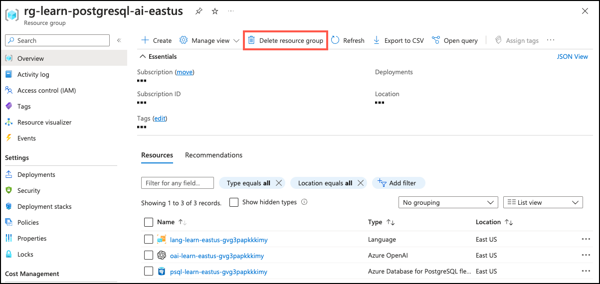

---
lab:
  title: 권장 사항 시스템을 위한 검색 함수 만들기
  module: Enable Semantic Search with Azure Database for PostgreSQL
---

# 권장 사항 시스템을 위한 검색 함수 만들기

의미 체계 검색을 사용하여 권장 사항 시스템을 빌드해 보겠습니다. 이 시스템은 제공된 샘플 목록을 기반으로 여러 목록을 권장합니다. 샘플은 사용자가 보고 있는 목록이나 사용자의 선호도에서 가져올 수 있습니다. `azure_openai` 확장을 활용한 PostgreSQL 함수로 시스템을 구현할 예정입니다.

이 연습이 끝나면 제공된 `sampleListingId` 목록과 가장 유사한 최대 `numResults`개의 목록을 제공하는 `recommend_listing` 함수를 정의하게 됩니다. 이 데이터를 사용하여 할인 목록 대신 권장 목록에 가입하는 것과 같은 새로운 기회를 유도할 수 있습니다.

## 시작하기 전에

관리 권한이 있는 [Azure 구독](https://azure.microsoft.com/free)이 필요하며 해당 구독에서 Azure OpenAI 액세스에 대한 승인을 받아야 합니다. Azure OpenAI 액세스가 필요한 경우 [Azure OpenAI 제한된 액세스](https://learn.microsoft.com/legal/cognitive-services/openai/limited-access) 페이지에서 신청하세요.

### Azure 구독에 리소스 배포

이 단계에서는 Azure Cloud Shell에서 Azure CLI 명령을 사용하여 리소스 그룹을 만들고 Bicep 스크립트를 실행하여 이 연습을 완료하는 데 필요한 Azure 서비스를 Azure 구독에 배포하는 방법을 안내합니다.

1. 웹 브라우저를 열고 [Azure Portal](https://portal.azure.com/)로 이동합니다.

2. Azure Portal 도구 모음의 **Cloud Shell** 아이콘을 선택하여 브라우저 창 아래쪽에 새 [Cloud Shell](https://learn.microsoft.com/azure/cloud-shell/overview) 창을 엽니다.

    

    메시지가 표시되면 *Bash* 셸을 여는 데 필요한 옵션을 선택합니다. 이전에 *PowerShell* 콘솔을 사용한 경우 *Bash* 셸로 전환합니다.

3. Cloud Shell 프롬프트에서 다음을 입력하여 연습 리소스가 포함된 GitHub 리포지토리를 복제합니다.

    ```bash
    git clone https://github.com/MicrosoftLearning/mslearn-postgresql.git
    ```

4. 다음으로, Azure CLI 명령을 사용하여 Azure 리소스를 만들 때 중복 입력을 줄이기 위해 변수를 정의하는 세 가지 명령을 실행합니다. 이 변수는 리소스 그룹에 할당할 이름(`RG_NAME`), 리소스를 배포할 Azure 지역(`REGION`), PostgreSQL 관리자 로그인용 임의 생성 암호(`ADMIN_PASSWORD`)를 나타냅니다.

    첫 번째 명령에서는 해당 변수에 `eastus` 지역을 할당하지만, 원하는 위치로 바꿀 수도 있습니다. 그러나 기본값을 바꾸는 경우 다른 [추상 요약을 지원하는 Azure 지역](https://learn.microsoft.com/azure/ai-services/language-service/summarization/region-support)을 선택해야 이 학습 경로의 모듈에 있는 모든 작업을 완료할 수 있습니다.

    ```bash
    REGION=eastus
    ```

    다음 명령에서는 이 연습에서 사용할 모든 리소스를 저장하는 리소스 그룹에 사용할 이름을 할당합니다. 해당 변수에는 `rg-learn-postgresql-ai-$REGION` 리소스 그룹 이름을 할당하며, 여기서 `$REGION` 부분은 앞에서 지정한 위치입니다. 그러나 원하는 다른 리소스 그룹 이름으로 변경할 수 있습니다.

    ```bash
    RG_NAME=rg-learn-postgresql-ai-$REGION
    ```

    마지막 명령에서는 PostgreSQL 관리자 로그인에 사용할 암호를 임의로 생성합니다. 나중에 PostgreSQL 유연한 서버에 연결하는 데 사용하기 위해 이 암호를 안전한 장소에 **복사해 두어야 합니다**.

    ```bash
    a=()
    for i in {a..z} {A..Z} {0..9}; 
     do
     a[$RANDOM]=$i
    done
    ADMIN_PASSWORD=$(IFS=; echo "${a[*]::18}")
    echo "Your randomly generated PostgreSQL admin user's password is:"
    echo $ADMIN_PASSWORD
    ```

5. 두 개 이상의 Azure 구독에 액세스할 수 있고 기본 구독이 이 연습에 대한 리소스 그룹 및 기타 리소스를 만드는 데 사용할 구독이 아닌 경우, 이 명령을 실행하여 적절한 구독을 설정하고 `<subscriptionName|subscriptionId>` 토큰을 사용할 구독의 이름 또는 ID로 바꿉니다.

    ```azurecli
    az account set --subscription <subscriptionName|subscriptionId>
    ```

6. 다음 Azure CLI 명령을 실행하여 리소스 그룹을 만듭니다.

    ```azurecli
    az group create --name $RG_NAME --location $REGION
    ```

7. 마지막으로 Azure CLI를 사용하여 Bicep 배포 스크립트를 실행하는 방법으로 리소스 그룹에 Azure 리소스를 프로비전합니다.

    ```azurecli
    az deployment group create --resource-group $RG_NAME --template-file "mslearn-postgresql/Allfiles/Labs/Shared/deploy.bicep" --parameters restore=false adminLogin=pgAdmin adminLoginPassword=$ADMIN_PASSWORD
    ```

    Bicep 배포 스크립트는 이 연습을 완료하는 데 필요한 Azure 서비스를 리소스 그룹으로 프로비전합니다. 배포 리소스에는 Azure Database for PostgreSQL - 유연한 서버, Azure OpenAI, Azure AI 언어 서비스가 포함됩니다. 또한 Bicep 스크립트는 `azure.extensions` 서버 매개 변수를 통해 PostgreSQL 서버의 _허용 목록_에 `azure_ai` 및 `vector` 확장을 추가하고, 서버에 `rentals` 데이터베이스를 만들고, Azure OpenAI Service에 `text-embedding-ada-002` 모델을 사용한 `embedding` 배포를 추가하는 등 몇 가지 구성 단계를 수행합니다. 이 Bicep 파일은 이 학습 경로의 모든 모듈에서 공유되므로 일부 연습에서는 배포된 리소스 중 일부만 사용할 수 있다는 점에 유의해야 합니다.

    배포를 완료하려면 보통 몇 분 정도 걸립니다. Cloud Shell에서 모니터링하거나 위에서 만든 리소스 그룹에 대한 **배포** 페이지로 이동하여 배포 진행 상황을 관찰할 수 있습니다.

8. 리소스 배포가 완료되면 Cloud Shell 창을 닫습니다.

### 배포 오류 문제 해결

Bicep 배포 스크립트를 실행할 때 몇 가지 오류가 발생할 수 있습니다.

- 이전에 이 학습 경로에 대한 Bicep 배포 스크립트를 실행한 후 리소스를 삭제한 경우, 리소스를 삭제하고 48시간 이내에 스크립트를 다시 실행하려고 하면 다음과 같은 오류 메시지가 표시될 수 있습니다.

    ```bash
    {"code": "InvalidTemplateDeployment", "message": "The template deployment 'deploy' is not valid according to the validation procedure. The tracking id is '4e87a33d-a0ac-4aec-88d8-177b04c1d752'. See inner errors for details."}
    
    Inner Errors:
    {"code": "FlagMustBeSetForRestore", "message": "An existing resource with ID '/subscriptions/{subscriptionId}/resourceGroups/rg-learn-postgresql-ai-eastus/providers/Microsoft.CognitiveServices/accounts/{accountName}' has been soft-deleted. To restore the resource, you must specify 'restore' to be 'true' in the property. If you don't want to restore existing resource, please purge it first."}
    ```

    이 메시지가 표시되면 위의 `azure deployment group create` 명령을 수정하여 `restore` 매개 변수를 `true`에 해당하도록 설정하고 다시 실행합니다.

- 선택한 지역이 특정 리소스를 프로비전하지 못하도록 제한된 경우 `REGION` 변수를 다른 위치로 설정하고 명령을 다시 실행하여 리소스 그룹을 만들고 Bicep 배포 스크립트를 실행해야 합니다.

    ```bash
    {"status":"Failed","error":{"code":"DeploymentFailed","target":"/subscriptions/{subscriptionId}/resourceGroups/{resourceGrouName}/providers/Microsoft.Resources/deployments/{deploymentName}","message":"At least one resource deployment operation failed. Please list deployment operations for details. Please see https://aka.ms/arm-deployment-operations for usage details.","details":[{"code":"ResourceDeploymentFailure","target":"/subscriptions/{subscriptionId}/resourceGroups/{resourceGrouName}/providers/Microsoft.DBforPostgreSQL/flexibleServers/{serverName}","message":"The resource write operation failed to complete successfully, because it reached terminal provisioning state 'Failed'.","details":[{"code":"RegionIsOfferRestricted","message":"Subscriptions are restricted from provisioning in this region. Please choose a different region. For exceptions to this rule please open a support request with Issue type of 'Service and subscription limits'. See https://review.learn.microsoft.com/en-us/azure/postgresql/flexible-server/how-to-request-quota-increase for more details."}]}]}}
    ```

- 책임 있는 AI 계약을 수락해야 하는 요구 사항으로 인해 스크립트가 AI 리소스를 만들 수 없는 경우 다음과 같은 오류가 발생할 수 있습니다. 이 경우 Azure Portal 사용자 인터페이스를 사용하여 Azure AI 서비스 리소스를 만든 다음 배포 스크립트를 다시 실행합니다.

    ```bash
    {"code": "InvalidTemplateDeployment", "message": "The template deployment 'deploy' is not valid according to the validation procedure. The tracking id is 'f8412edb-6386-4192-a22f-43557a51ea5f'. See inner errors for details."}
     
    Inner Errors:
    {"code": "ResourceKindRequireAcceptTerms", "message": "This subscription cannot create TextAnalytics until you agree to Responsible AI terms for this resource. You can agree to Responsible AI terms by creating a resource through the Azure Portal then trying again. For more detail go to https://go.microsoft.com/fwlink/?linkid=2164190"}
    ```

## Azure Cloud Shell에서 psql을 사용하여 데이터베이스에 연결

이 작업에서는 [Azure Cloud Shell](https://learn.microsoft.com/azure/cloud-shell/overview)의 [psql 명령줄 유틸리티](https://www.postgresql.org/docs/current/app-psql.html)를 사용하여 Azure Database for PostgreSQL 서버의 `rentals` 데이터베이스에 연결합니다.

1. [Azure Portal](https://portal.azure.com/)에서 새로 만든 Azure Database for PostgreSQL - 유연한 서버로 이동합니다.

2. 리소스 메뉴의 **설정**에서 **데이터베이스**를 선택하고 `rentals` 데이터베이스에 대한 **연결**을 선택합니다. **연결**을 선택해도 실제로 데이터베이스에 연결되지는 않습니다. 다양한 방법을 사용하여 데이터베이스에 연결하기 위한 지침만 제공합니다. **브라우저에서 또는 로컬로 연결** 지침을 검토하고 해당 지침을 사용하여 Azure Cloud Shell을 사용하여 연결합니다.

    

3. Cloud Shell의 "사용자 pgAdmin에 대한 암호" 프롬프트에서 **pgAdmin** 로그인에 대해 임의로 생성된 암호를 입력합니다.

    로그인하면 `rentals` 데이터베이스에 대한 `psql` 프롬프트가 표시됩니다.

4. 이 연습의 이후 부분에서는 계속 Cloud Shell에서 작업하므로 창의 오른쪽 위에 있는 **최대화** 버튼을 선택하여 브라우저 창 내에서 해당 창을 확장하면 도움이 될 수 있습니다.

    

## 설정: 확장 구성

벡터를 저장 및 쿼리하고 포함을 생성하려면 Azure Database for PostgreSQL 유연한 서버에서 `vector` 및 `azure_ai` 두 확장을 허용 목록에 추가하고 사용하도록 설정해야 합니다.

1. 두 확장을 모두 허용 목록에 추가하려면 [PostgreSQL 확장을 사용하는 방법](https://learn.microsoft.com/en-us/azure/postgresql/flexible-server/concepts-extensions#how-to-use-postgresql-extensions)의 지침에 따라 서버 매개 변수 `azure.extensions`에 `vector` 및 `azure_ai` 확장을 추가합니다.

2. `vector` 확장을 사용하도록 설정하기 위해 다음 SQL 명령을 실행합니다. 자세한 지침은 [Azure Database for PostgreSQL - 유연한 서버에서 `pgvector`를 사용하도록 설정하고 사용하는 방법](https://learn.microsoft.com/en-us/azure/postgresql/flexible-server/how-to-use-pgvector#enable-extension)을 참조하세요.

    ```sql
    CREATE EXTENSION vector;
    ```

3. `azure_ai` 확장을 사용하도록 설정하기 위해 다음 SQL 명령을 실행합니다. Azure OpenAI 리소스에 대한 엔드포인트 및 API 키가 필요합니다. 자세한 지침은 [`azure_ai` 확장을 사용하도록 설정](https://learn.microsoft.com/en-us/azure/postgresql/flexible-server/generative-ai-azure-overview#enable-the-azure_ai-extension)을 참조하세요.

    ```sql
    CREATE EXTENSION azure_ai;
    SELECT azure_ai.set_setting('azure_openai.endpoint', 'https://<endpoint>.openai.azure.com');
    SELECT azure_ai.set_setting('azure_openai.subscription_key', '<API Key>');
    ```

## 샘플 데이터를 이용해 데이터베이스 작성

`azure_ai` 확장을 탐색하기 전에 `rentals` 데이터베이스에 테이블을 몇 개 추가하고 샘플 데이터로 채워 확장의 기능을 검토할 때 사용할 정보를 준비합니다.

1. 다음 명령을 실행하여 임대 부동산 목록 및 고객 리뷰 데이터를 저장하기 위한 `listings` 및 `reviews` 테이블을 만듭니다.

    ```sql
    DROP TABLE IF EXISTS listings;
    
    CREATE TABLE listings (
        id int,
        name varchar(100),
        description text,
        property_type varchar(25),
        room_type varchar(30),
        price numeric,
        weekly_price numeric
    );
    ```

2. 다음으로, `COPY` 명령을 사용하여 위에서 만든 각 테이블에 CSV 파일의 데이터를 로드합니다. 먼저 다음 명령을 사용하여 `listings` 테이블을 채웁니다.

    ```sql
    \COPY listings FROM 'mslearn-postgresql/Allfiles/Labs/Shared/listings.csv' CSV HEADER
    ```

    명령의 출력은 `COPY 50`이어야 합니다. 이는 CSV 파일의 테이블에 50개의 행이 기록되었음을 나타냅니다.

## 포함 벡터 만들기 및 저장

이제 샘플 데이터가 있으므로 포함 벡터를 생성하고 저장할 차례입니다. `azure_ai` 확장을 사용하면 Azure OpenAI 포함 API를 쉽게 호출할 수 있습니다.

1. 포함 벡터 열을 추가합니다.

    `text-embedding-ada-002` 모델은 1,536개의 차원을 반환하도록 구성되었으므로 벡터 열 크기에 이 값을 사용합니다.

    ```sql
    ALTER TABLE listings ADD COLUMN listing_vector vector(1536);
    ```

1. azure_ai 확장에서 구현되는 create_embeddings 사용자 정의 함수를 통해 Azure OpenAI를 호출하여 각 목록에 대한 설명의 포함 벡터를 생성합니다.

    ```sql
    UPDATE listings
    SET listing_vector = azure_openai.create_embeddings('embedding', description, max_attempts => 5, retry_delay_ms => 500)
    WHERE listing_vector IS NULL;
    ```

    사용 가능한 할당량에 따라 몇 분 정도 걸릴 수 있습니다.

1. 이 쿼리를 실행하여 예제 벡터를 참조합니다.

    ```sql
    SELECT listing_vector FROM listings LIMIT 1;
    ```

    이것과 유사하지만 벡터 열이 1536개인 결과가 나타납니다.

    ```sql
    postgres=> SELECT listing_vector FROM listings LIMIT 1;
    -[ RECORD 1 ]--+------ ...
    listing_vector | [-0.0018742813,-0.04530062,0.055145424, ... ]
    ```

## 권장 사항 함수 만들기

권장 사항 함수는 `sampleListingId` 변수를 사용하여 가장 유사한 다른 목록 `numResults`개를 반환합니다. 이를 위해 샘플 목록의 이름 및 설명에 대한 포함을 만들고 목록의 포함에 대해 해당 쿼리 벡터의 의미 체계 검색을 실행합니다.

```sql
CREATE FUNCTION
    recommend_listing(sampleListingId int, numResults int) 
RETURNS TABLE(
            out_listingName text,
            out_listingDescription text,
            out_score real)
AS $$ 
DECLARE
    queryEmbedding vector(1536); 
    sampleListingText text; 
BEGIN 
    sampleListingText := (
     SELECT
        name || ' ' || description
     FROM
        listings WHERE id = sampleListingId
    ); 

    queryEmbedding := (
     azure_openai.create_embeddings('embedding', sampleListingText, max_attempts => 5, retry_delay_ms => 500)
    );

    RETURN QUERY 
    SELECT
        name::text,
        description,
        -- cosine distance:
        (listings.listing_vector <=> queryEmbedding)::real AS score
    FROM
        listings 
    ORDER BY score ASC LIMIT numResults;
END $$
LANGUAGE plpgsql; 
```

여러 텍스트 열을 단일 포함 벡터로 결합하는 등 이 함수를 사용자 지정하는 더 많은 방법은 [권장 사항 시스템](https://learn.microsoft.com/en-us/azure/postgresql/flexible-server/generative-ai-recommendation-system) 예제를 참조하세요.

## 권장 사항 함수 쿼리

권장 사항 함수를 쿼리하려면 목록 ID와 만들 권장 사항의 수를 전달합니다.

```sql
select out_listingName, out_score from recommend_listing( (SELECT id from listings limit 1), 20); -- search for 20 listing recommendations closest to a listing
```

다음과 유사한 결과가 나타납니다.

```sql
            out_listingname          | out_score 
-------------------------------------+-------------
 Sweet Seattle Urban Homestead 2 Bdr | 0.012512862
 Lovely Cap Hill Studio has it all!  | 0.09572035
 Metrobilly Retreat                  | 0.0982959
 Cozy Seattle Apartment Near UW      | 0.10320047
 Sweet home in the heart of Fremont  | 0.10442386
 Urban Chic, West Seattle Apartment  | 0.10654513
 Private studio apartment with deck  | 0.107096426
 Light and airy, steps to the Lake.  | 0.11008232
 Backyard Studio Apartment near UW   | 0.111279964
 2bed Rm Inner City Suite Near Dwtn  | 0.111340374
 West Seattle Vacation Junction      | 0.111758955
 Green Lake Private Ground Floor BR  | 0.112196356
 Stylish Queen Anne Apartment        | 0.11250153
 Family Friendly Modern Seattle Home | 0.11257711
 Bright Cheery Room in Seattle House | 0.11290849
 Big sunny central house with view!  | 0.11382967
 Modern, Light-Filled Fremont Flat   | 0.114443965
 Chill Central District 2BR          | 0.1153879
 Sunny Bedroom w/View: Wallingford   | 0.11549795
 Seattle Turret House (Apt 4)        | 0.11590502
```

함수 런타임을 보려면 Azure Portal의 서버 매개 변수 섹션에서 `track_functions` 변수가 사용하도록 설정되어 있는지 확인합니다(`PL` 또는 `ALL` 사용 가능).


그런 다음에는 함수 통계 테이블을 쿼리할 수 있습니다.

```sql
SELECT * FROM pg_stat_user_functions WHERE funcname = 'recommend_listing';
```

다음과 유사한 결과가 나타나야 합니다.

```sql
 funcid | schemaname |    funcname       | calls | total_time | self_time 
--------+------------+-------------------+-------+------------+-----------
  28753 | public     | recommend_listing |     1 |    268.357 | 268.357
(1 row)
```

이 벤치마크에서는 샘플 목록의 포함을 획득하고 ~270ms 내로 약 4,000개의 문서에 대한 의미 체계 검색을 수행했습니다.

## 작업 확인

1. 함수에 올바른 서명이 있는지 확인합니다.

    ```sql
    \df recommend_listing
    ```

    다음이 표시되어야 합니다.

    ```sql
    public | recommend_listing | TABLE(out_listingname text, out_listingdescription text, out_score real) | samplelistingid integer, numre
    sults integer | func
    ```

2. 다음 쿼리를 사용하여 쿼리할 수 있는지 확인합니다.

    ```sql
    select out_listingName, out_score from recommend_listing( (SELECT id from listings limit 1), 20); -- search for 20 listing recommendations closest to a listing
    ```

## 정리

이 연습을 완료한 후에는 만든 Azure 리소스를 삭제합니다. 요금은 데이터베이스 사용량이 아니라 구성된 용량에 대해 부과됩니다. 다음 지침에 따라 리소스 그룹과 이 랩을 위해 만든 모든 리소스를 삭제합니다.

> [!Note]
>
> 이 학습 경로에서 추가 모듈을 완료하려는 경우 원하는 모든 모듈을 완료할 때까지는 이 작업을 건너뛸 수 있습니다.

1. 웹 브라우저를 열어 [Azure Portal](https://portal.azure.com/)로 이동한 뒤 홈페이지의 Azure 서비스에서 **리소스 그룹**을 선택합니다.

    

2. 원하는 필드 검색 상자의 필터에 이 랩을 위해 만든 리소스 그룹의 이름을 입력한 다음 목록에서 이 리소스 그룹을 선택합니다.

3. 리소스 그룹의 **개요** 페이지에서 **리소스 그룹 삭제**를 선택합니다.

    

4. 확인 대화 상자에서 삭제할 리소스 그룹의 이름을 입력하여 확인하고 **삭제**를 선택합니다.
