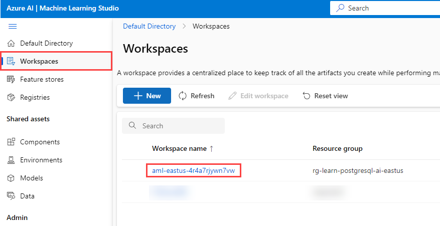
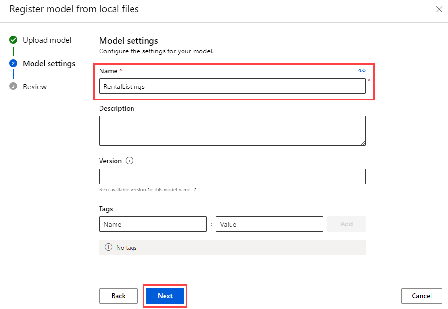

---
lab:
  title: Azure Machine Learning을 사용하여 유추 수행
  module: Use Azure Machine Learning Inferencing with Azure Database for PostgreSQL
---

# Azure Machine Learning을 사용하여 유추 수행

Margie's Travel(MT)의 수석 개발자로서 단기 임대에서 야간 임대 가격을 예측하는 기능을 개발해 달라는 요청을 받았습니다. 일부 기록 데이터를 텍스트 파일로 수집했으며 이를 사용하여 Azure Machine Learning에서 간단한 회귀 모델을 학습하려 합니다. 그런 다음 Azure Database for PostgreSQL 유연한 서버 데이터베이스에서 호스팅한 데이터에 대해 해당 모델을 사용하려고 합니다.

이 연습에서는 Azure Machine Learning의 자동화된 Machine Learning 기능을 사용하여 만든 모델을 배포합니다. 그런 다음 배포된 모델을 사용하여 단기 임대 부동산의 야간 판매 가격을 예측합니다.

## 시작하기 전에

관리 권한이 있는 [Azure 구독](https://azure.microsoft.com/free)이 필요합니다.

### Azure 구독에 리소스 배포

이 단계에서는 Azure Cloud Shell에서 Azure CLI 명령을 사용하여 리소스 그룹을 만들고 Bicep 스크립트를 실행하여 이 연습을 완료하는 데 필요한 Azure 서비스를 Azure 구독에 배포하는 방법을 안내합니다.

1. 웹 브라우저를 열고 [Azure Portal](https://portal.azure.com/)로 이동합니다.

2. Azure Portal 도구 모음의 **Cloud Shell** 아이콘을 선택하여 브라우저 창 아래쪽에 새 [Cloud Shell](https://learn.microsoft.com/azure/cloud-shell/overview) 창을 엽니다.

    

    메시지가 표시되는 경우 *Bash* 셸을 여는 데 필요한 옵션을 선택합니다. 이전에 *PowerShell* 콘솔을 사용한 적이 있다면 이것을 *Bash* 셸로 전환합니다.

3. Cloud Shell 프롬프트에서 다음을 입력하여 연습 리소스가 포함된 GitHub 리포지토리를 복제합니다.

    ```bash
    git clone https://github.com/MicrosoftLearning/mslearn-postgresql.git
    ```

    이전 모듈에서 이 GitHub 리포지토리를 이미 복제한 경우 계속 사용할 수 있으며 다음과 같은 오류 메시지가 표시될 수 있습니다.

    ```bash
    fatal: destination path 'mslearn-postgresql' already exists and is not an empty directory.
    ```

    이 메시지가 표시되면 다음 단계를 안전하게 진행할 수 있습니다.

4. 그 다음 Azure CLI 명령을 사용하여 Azure 리소스를 만들 때 중복 입력을 줄이기 위해 변수를 정의하는 세 가지 명령을 실행합니다. 이 변수는 리소스 그룹에 할당할 이름(`RG_NAME`), 리소스를 배포할 Azure 지역(`REGION`), PostgreSQL 관리자 로그인용 임의 생성 암호(`ADMIN_PASSWORD`)를 나타냅니다.

    첫 번째 명령에서는 해당 변수에 `eastus` 지역을 할당하지만, 원하는 위치로 바꿀 수도 있습니다. 그러나 기본값을 바꾸는 경우 다른 [추상 요약을 지원하는 Azure 지역](https://learn.microsoft.com/azure/ai-services/language-service/summarization/region-support)을 선택해야 이 학습 경로의 모듈에 있는 모든 작업을 완료할 수 있습니다.

    ```bash
    REGION=eastus
    ```

    다음 명령에서는 이 연습에서 사용할 모든 리소스를 저장하는 리소스 그룹에 사용할 이름을 할당합니다. 해당 변수에는 `rg-learn-postgresql-ai-$REGION` 리소스 그룹 이름을 할당하며, 여기서 `$REGION` 부분은 앞에서 지정한 위치입니다. 그러나 원하는 다른 리소스 그룹 이름으로 변경할 수 있습니다.

    ```bash
    RG_NAME=rg-learn-postgresql-ai-$REGION
    ```

    마지막 명령에서는 PostgreSQL 관리자 로그인에 사용할 암호를 임의로 생성합니다. 나중에 PostgreSQL 유연한 서버에 연결하는 데 사용할 안전한 장소에 복사해야 합니다.

    ```bash
    a=()
    for i in {a..z} {A..Z} {0..9}; 
       do
       a[$RANDOM]=$i
    done
    ADMIN_PASSWORD=$(IFS=; echo "${a[*]::18}")
    echo "Your randomly generated PostgreSQL admin user's password is:"
    echo $ADMIN_PASSWORD
    ```

5. 두 개 이상의 Azure 구독에 액세스할 수 있고 기본 구독이 이 연습에 대한 리소스 그룹 및 기타 리소스를 만드는 데 사용할 구독이 아닌 경우, 이 명령을 실행할 때 적절한 구독을 설정하고 `<subscriptionName|subscriptionId>` 토큰을 사용할 구독의 이름 또는 ID로 바꿉니다.

    ```azurecli
    az account set --subscription <subscriptionName|subscriptionId>
    ```

6. 다음 Azure CLI 명령을 실행하여 리소스 그룹을 만듭니다.

    ```azurecli
    az group create --name $RG_NAME --location $REGION
    ```

7. 마지막으로 Azure CLI를 사용하여 Bicep 배포 스크립트를 실행하는 방법으로 리소스 그룹에 Azure 리소스를 프로비전합니다.

    ```azurecli
    az deployment group create --resource-group $RG_NAME --template-file "mslearn-postgresql/Allfiles/Labs/Shared/deploy-azure-machine-learning.bicep" --parameters adminLogin=pgAdmin adminLoginPassword=$ADMIN_PASSWORD
    ```

    Bicep 배포 스크립트는 이 연습을 완료하는 데 필요한 Azure 서비스를 리소스 그룹으로 프로비전합니다. 배포된 리소스에는 Azure Database for PostgreSQL 유연한 서버 및 Azure Machine Learning 작업 영역이 포함됩니다. 또한 배포 스크립트는 Azure Blob Storage 계정, Azure Key Vault, Azure Container Repository, Azure Log Analytics 작업 영역 및 Azure Application Insights 인스턴스를 포함하여 Azure Machine Learning 작업 영역을 인스턴스화하기 위한 모든 필수 구성 요소 서비스를 만듭니다. 또한 Bicep 스크립트는 PostgreSQL 서버의 _allowlist_에 (azure.extensions 서버 매개 변수를 통해) `azure_ai` 및 `vector` 확장을 추가하고 서버에 `rentals`이라는 데이터베이스를 생성하는 등 몇 가지 구성 단계를 수행합니다. **Bicep 파일은 이 학습 경로의 다른 모듈과 다릅니다.**

    배포를 완료하려면 보통 몇 분 정도 걸립니다. Cloud Shell에서 모니터링하거나 위에서 만든 리소스 그룹에 대한 **배포** 페이지로 이동하여 배포 진행 상황을 관찰할 수 있습니다.

8. 리소스 배포가 완료되면 Cloud Shell 창을 닫습니다.

### 배포 오류 문제 해결

Bicep 배포 스크립트를 실행할 때 몇 가지 오류가 발생할 수 있습니다.

- 이전에 이 학습 경로에 대한 Bicep 배포 스크립트를 실행한 후 리소스를 삭제한 경우, 리소스를 삭제하고 48시간 이내에 스크립트를 다시 실행하려고 하면 다음과 같은 오류 메시지가 표시될 수 있습니다.

    ```bash
    {"code": "InvalidTemplateDeployment", "message": "The template deployment 'deploy' is not valid according to the validation procedure. The tracking id is '4e87a33d-a0ac-4aec-88d8-177b04c1d752'. See inner errors for details."}
    
    Inner Errors:
    {"code": "FlagMustBeSetForRestore", "message": "An existing resource with ID '/subscriptions/{subscriptionId}/resourceGroups/rg-learn-postgresql-ai-eastus/providers/Microsoft.CognitiveServices/accounts/{accountName}' has been soft-deleted. To restore the resource, you must specify 'restore' to be 'true' in the property. If you don't want to restore existing resource, please purge it first."}
    ```

    이 메시지가 표시되면 위의 `azure deployment group create` 명령을 수정하여 `restore` 매개 변수를 `true`에 해당하도록 설정하고 다시 실행합니다.

- 선택한 지역이 특정 리소스를 프로비전하지 못하도록 제한된 경우 `REGION` 변수를 다른 위치로 설정하고 명령을 다시 실행하여 리소스 그룹을 만들고 Bicep 배포 스크립트를 실행해야 합니다.

    ```bash
    {"status":"Failed","error":{"code":"DeploymentFailed","target":"/subscriptions/{subscriptionId}/resourceGroups/{resourceGrouName}/providers/Microsoft.Resources/deployments/{deploymentName}","message":"At least one resource deployment operation failed. Please list deployment operations for details. Please see https://aka.ms/arm-deployment-operations for usage details.","details":[{"code":"ResourceDeploymentFailure","target":"/subscriptions/{subscriptionId}/resourceGroups/{resourceGrouName}/providers/Microsoft.DBforPostgreSQL/flexibleServers/{serverName}","message":"The resource write operation failed to complete successfully, because it reached terminal provisioning state 'Failed'.","details":[{"code":"RegionIsOfferRestricted","message":"Subscriptions are restricted from provisioning in this region. Please choose a different region. For exceptions to this rule please open a support request with Issue type of 'Service and subscription limits'. See https://review.learn.microsoft.com/en-us/azure/postgresql/flexible-server/how-to-request-quota-increase for more details."}]}]}}
    ```

- 책임 있는 AI 계약을 수락해야 하는 요구 사항으로 인해 스크립트가 AI 리소스를 만들 수 없는 경우 다음과 같은 오류가 발생할 수 있습니다. 이 경우 Azure Portal 사용자 인터페이스를 사용하여 Azure AI 서비스 리소스를 만든 다음 배포 스크립트를 다시 실행합니다.

    ```bash
    {"code": "InvalidTemplateDeployment", "message": "The template deployment 'deploy' is not valid according to the validation procedure. The tracking id is 'f8412edb-6386-4192-a22f-43557a51ea5f'. See inner errors for details."}
     
    Inner Errors:
    {"code": "ResourceKindRequireAcceptTerms", "message": "This subscription cannot create TextAnalytics until you agree to Responsible AI terms for this resource. You can agree to Responsible AI terms by creating a resource through the Azure Portal then trying again. For more detail go to https://go.microsoft.com/fwlink/?linkid=2164190"}
    ```

## Azure Machine Learning 모델 배포

첫 번째 단계는 Azure Machine Learning에 모델을 배포하는 것입니다. 이 리포지토리에는 목록 데이터 세트로 학습된 모델의 예제가 포함되어 있으며, 이는 PostgreSQL 통합에서 사용됩니다.

1. `mlflow-model.zip` 파일을 [mslearn-postgresql 리포지토리](../../Allfiles/Labs/Shared/mlflow-model.zip)에서 다운로드합니다. 이 파일을 **mlflow-model**이라는 폴더로 추출합니다.

2. [Azure Portal](https://portal.azure.com/)에서 새로 만든 Azure Machine Learning 작업 영역으로 이동합니다.

3. **스튜디오 시작** 버튼을 선택하여 Azure Machine Learning 스튜디오를 엽니다.

    

4. **작업 영역** 메뉴 옵션을 선택하고 새로 만든 Azure Machine Learning 작업 영역을 선택합니다.

    

5. **자산** 메뉴에서 **모델** 메뉴 옵션을 선택합니다. 그런 다음 **+ 등록** 메뉴 옵션을 선택하고 **로컬 파일에서**를 선택합니다.

    

6. **모델 업로드** 메뉴에서 모델 유형을 **MLflow**로 설정합니다. 그런 다음 **찾아보기**를 선택하고 **mlflow-model** 폴더로 이동하여 자산을 업로드합니다. 그런 다음 **다음** 단추를 선택하여 계속합니다.

    

7. 모델 이름을 **RentalListings**로 지정한 다음 **다음** 단추를 선택합니다.

    

8. **등록** 단추를 선택하여 모델 등록을 완료합니다. 이 작업을 수행하면 **모델** 페이지로 돌아갑니다. 새로 만들어진 모델을 선택합니다.

    > [!Note]
    >
    > 모델이 표시되지 않으면 **새로 고침** 메뉴 옵션 단추를 선택하여 페이지를 다시 로드합니다. 그러면 **RentalListings** 모델이 표시됩니다.

9. **배포** 단추 옵션을 선택하고 **실시간 엔드포인트**를 새로 만듭니다.

    

10. 배포 플라이아웃 메뉴에서 **가상 머신**을 **Standard_DS2_v2**와 같이 설정하고 **인스턴스 수**를 1로 설정합니다. **배포** 버튼을 선택합니다. 배포 프로세스에는 가상 머신 프로비전과 Docker 컨테이너로 모델을 배포하는 과정이 포함되므로 배포를 완료하는 데 몇 분 정도 걸릴 수 있습니다.

    

11. 엔드포인트가 배포된 후 **사용** 탭으로 이동하여 다음 섹션에서 사용할 수 있도록 REST 엔드포인트와 기본 키를 복사합니다.

    

12. 엔드포인트가 올바르게 실행되고 있는지 테스트하려면 엔드포인트에서 **테스트** 탭을 사용할 수 있습니다. 그런 다음, 다음 블록에 붙여넣고 현재 존재하는 입력을 바꿉니다. **테스트** 단추를 선택하면 특정 숙소의 1박 대여 시 예상되는 미화 수익을 나타내는 10진수 단일값이 있는 배열이 포함된 JSON 출력을 확인할 수 있습니다.

    ```json
    {
        "input_data": {
            "columns": [
                "host_is_superhost",
                "host_has_profile_pic",
                "host_identity_verified",
                "neighbourhood_group_cleansed",
                "zipcode",
                "property_type",
                "room_type",
                "accommodates",
                "bathrooms",
                "bedrooms",
                "beds"
            ],
            "index": [0],
            "data": [["0", "0", "0", "Central Area", "98122", "House", "Entire home/apt", 4, 1.5, 3, 3]]
        }
    }
    ```

    

## Azure Cloud Shell에서 psql을 사용하여 데이터베이스에 연결

이 작업에서는 [Azure Cloud Shell](https://learn.microsoft.com/azure/cloud-shell/overview)의 [psql 명령줄 유틸리티](https://www.postgresql.org/docs/current/app-psql.html)를 사용하여 Azure Database for PostgreSQL 유연한 서버의 `rentals` 데이터베이스에 연결합니다.

1. [Azure Portal](https://portal.azure.com/)에서 새로 만든 Azure Database for PostgreSQL 유연한 서버로 이동합니다.

2. 리소스 메뉴의 **설정**에서 **데이터베이스**를 선택하고 `rentals` 데이터베이스에 대한 **연결**을 선택합니다.

    

3. Cloud Shell의 "사용자 pgAdmin에 대한 암호" 프롬프트에서 **pgAdmin** 로그인에 대해 임의로 생성된 암호를 입력합니다.

    로그인하면 `rentals` 데이터베이스에 대한 `psql` 프롬프트가 표시됩니다.

4. 이 연습의 이후 부분에서는 계속 Cloud Shell에서 작업하므로 창의 오른쪽 위에 있는 **최대화** 버튼을 선택하여 브라우저 창 내에서 해당 창을 확장하면 도움이 될 수 있습니다.

    

## `azure_ai` 확장 설치 및 구성

`azure_ai` 확장을 사용하기 전에는 확장을 데이터베이스에 설치하고 Azure AI Services 리소스에 연결하도록 구성해야 합니다. `azure_ai` 확장을 사용하면 Azure OpenAI 및 Azure AI 언어 서비스를 데이터베이스에 통합할 수 있습니다. 데이터베이스에서 확장을 사용하도록 설정하려면 다음 단계를 수행합니다.

1. `psql` 프롬프트에서 다음 명령을 실행하여, 환경을 설정할 때 실행한 Bicep 배포 스크립트를 통해 `azure_ai` 및 `vector`확장이 서버의 _허용 목록_에 성공적으로 추가되었는지 확인합니다.

    ```sql
    SHOW azure.extensions;
    ```

    이 명령은 서버의 _허용 목록_에 확장 목록을 표시합니다. 모든 항목이 올바르게 설치된 경우 다음과 같이 출력에 `azure_ai` 및 `vector`가 포함되어 있어야 합니다.

    ```sql
     azure.extensions 
    ------------------
     azure_ai,vector
    ```

    Azure Database for PostgreSQL 유연한 서버에 확장을 설치 및 사용하려면 [PostgreSQL 확장 사용 방법](https://learn.microsoft.com/azure/postgresql/flexible-server/concepts-extensions#how-to-use-postgresql-extensions)에 설명된 대로 서버의 _허용 목록_에 추가해야 합니다.

2. 이제 [CREATE EXTENSION](https://www.postgresql.org/docs/current/sql-createextension.html) 명령을 사용하여 `azure_ai` 확장을 설치할 수 있습니다.

    ```sql
    CREATE EXTENSION IF NOT EXISTS azure_ai;
    ```

    `CREATE EXTENSION` 명령은 스크립트 파일을 실행하여 데이터베이스에 새 확장을 로드합니다. 이 스크립트는 일반적으로 함수, 데이터 형식, 스키마와 같은 새 SQL 개체를 만듭니다. 동일한 이름의 확장이 이미 있는 경우 오류가 표시됩니다. `IF NOT EXISTS` 문을 추가하면 확장이 이미 설치된 경우 오류를 표시하지 않고 명령을 실행할 수 있습니다.

3. 그런 다음, `azure_ai.set_setting()` 함수를 사용하여 Azure Machine Learning 배포된 엔드포인트에 대한 연결을 구성해야 합니다. 배포된 엔드포인트 및 해당 키를 가리키도록 `azure_ml` 설정을 구성합니다. `azure_ml.scoring_endpoint` 값은 엔드포인트의 REST URL입니다. `azure_ml.endpoint_key`의 값은 키 1 또는 키 2의 값이 됩니다.

    ```sql
    SELECT azure_ai.set_setting('azure_ml.scoring_endpoint','https://<YOUR_ENDPOINT>.<YOUR_REGION>.inference.ml.azure.com/score');
    ```

    ```sql
    SELECT azure_ai.set_setting('azure_ml.endpoint_key', '<YOUR_KEY>');
    ```

## 가격에 대한 목록을 포함하는 테이블 만들기

가격을 책정하려는 단기 임대 목록을 저장하려면 하나의 테이블이 필요합니다.

1. `rentals` 데이터베이스에서 다음 명령을 실행하여 새 `listings_to_price` 테이블을 만듭니다.

    ```sql
    CREATE TABLE listings_to_price (
        id INT GENERATED BY DEFAULT AS IDENTITY PRIMARY KEY,
        host_is_superhost INT NOT NULL,
        host_has_profile_pic INT NOT NULL,
        host_identity_verified INT NOT NULL,
        neighbourhood_group_cleansed VARCHAR(75) NOT NULL,
        zipcode VARCHAR(5) NOT NULL,
        property_type VARCHAR(30) NOT NULL,
        room_type VARCHAR(30) NOT NULL,
        accommodates INT NOT NULL,
        bathrooms DECIMAL(3,1) NOT NULL,
        bedrooms INT NOT NULL,
        beds INT NOT NULL
    );
    ```

2. 다음으로 `rentals` 데이터베이스에서 다음 명령을 실행하여 새 임대 목록 데이터를 삽입합니다.

    ```sql
    INSERT INTO listings_to_price(host_is_superhost, host_has_profile_pic, host_identity_verified,
        neighbourhood_group_cleansed, zipcode, property_type, room_type,
        accommodates, bathrooms, bedrooms, beds)
    VALUES
        (1, 1, 1, 'Queen Anne', '98119', 'House', 'Private room', 2, 1.0, 1, 1),
        (0, 1, 1, 'University District', '98105', 'Apartment', 'Entire home/apt', 4, 1.5, 2, 2),
        (0, 0, 0, 'Central Area', '98122', 'House', 'Entire home/apt', 4, 1.5, 3, 3),
        (0, 0, 0, 'Downtown', '98101', 'House', 'Entire home/apt', 4, 1.5, 3, 3),
        (0, 0, 0, 'Capitol Hill', '98122', 'House', 'Entire home/apt', 4, 1.5, 3, 3);
    ```

    이 명령은 새 목록 데이터의 5개 행을 삽입합니다.

## 목록 데이터를 변환하는 함수 만들기

언어 번역 테이블을 채우기 위해 데이터를 일괄적으로 로드하는 저장 프로시저를 만듭니다.

1. `psql` 프롬프트에서 다음 명령을 실행하여 `price_listing`(이)라는 새 함수를 만듭니다.

    ```sql
    CREATE OR REPLACE FUNCTION price_listing (
        IN host_is_superhost INT, IN host_has_profile_pic INT, IN host_identity_verified INT,
        IN neighbourhood_group_cleansed VARCHAR(75), IN zipcode VARCHAR(5), IN property_type VARCHAR(30),
        IN room_type VARCHAR(30), IN accommodates INT, IN bathrooms DECIMAL(3,1), IN bedrooms INT, IN beds INT)
    RETURNS DECIMAL(6,2)
    AS $$
        SELECT CAST(jsonb_array_elements(inference.inference) AS DECIMAL(6,2)) AS expected_price
        FROM azure_ml.inference(('
        {
            "input_data": {
                "columns": [
                    "host_is_superhost",
                    "host_has_profile_pic",
                    "host_identity_verified",
                    "neighbourhood_group_cleansed",
                    "zipcode",
                    "property_type",
                    "room_type",
                    "accommodates",
                    "bathrooms",
                    "bedrooms",
                    "beds"
                ],
                "index": [0],
                "data": [["' || host_is_superhost || '", "' || host_has_profile_pic || '", "' || host_identity_verified || '", "' ||
                neighbourhood_group_cleansed || '", "' || zipcode || '", "' || property_type || '", "' || room_type || '", ' ||
                accommodates || ', ' || bathrooms || ', ' || bedrooms || ', ' || beds || ']]
            }
        }')::jsonb, deployment_name=>'rentallistings-1');
    $$ LANGUAGE sql;
    ```

    > [!Note]
    >
    > 기본적으로 배포 이름은 모델 이름(**rentallistings**)과 버전 번호(**1**)의 조합입니다. 새 버전의 모델을 배포하고 기본 배포 이름을 사용하는 경우 새 배포 이름은 **rentallistings-2**가 됩니다.

2. 다음 SQL 명령을 사용하여 함수를 실행합니다.

    ```sql
    SELECT * FROM price_listing(0, 0, 0, 'Central Area', '98122', 'House', 'Entire home/apt', 4, 1.5, 3, 3);
    ```

    이 쿼리는 야간 임대 가격 추정치를 10진수 형식으로 반환합니다.

3. 다음 SQL 명령을 사용하여 `listings_to_price` 테이블의 각 행에 대한 함수를 호출합니다.

    ```sql
    SELECT l2p.*, expected_price
    FROM listings_to_price l2p
        CROSS JOIN LATERAL price_listing(l2p.host_is_superhost, l2p.host_has_profile_pic, l2p.host_identity_verified,
            l2p.neighbourhood_group_cleansed, l2p.zipcode, l2p.property_type, l2p.room_type,
            l2p.accommodates, l2p.bathrooms, l2p.bedrooms, l2p.beds) expected_price;
    ```

    이 쿼리는 `listings_to_price`의 각 행에 대해 하나씩 5개의 행을 반환합니다. `listings_to_price` 테이블의 모든 열과 `price_listing()` 함수의 결과가 `expected_price`(으)로 포함됩니다.

## 정리

이 연습을 완료한 후에는 만든 Azure 리소스를 삭제합니다. 요금은 데이터베이스 사용량이 아니라 구성된 용량에 대해 부과됩니다. 다음 지침에 따라 리소스 그룹과 이 랩을 위해 만든 모든 리소스를 삭제합니다.

1. 웹 브라우저를 열어 [Azure Portal](https://portal.azure.com/)로 이동한 뒤 홈페이지의 Azure 서비스에서 **리소스 그룹**을 선택합니다.

    

2. 필드 검색 상자의 필터에 이 랩을 위해 만든 리소스 그룹의 이름을 입력한 다음 목록에서 이 리소스 그룹을 선택합니다.

3. 리소스 그룹의 **개요** 페이지에서 **리소스 그룹 삭제**를 선택합니다.

    

4. 확인 대화 상자에서 삭제할 리소스 그룹의 이름을 입력하여 확인하고 **삭제**를 선택합니다.
